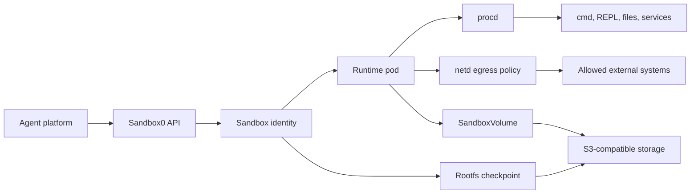
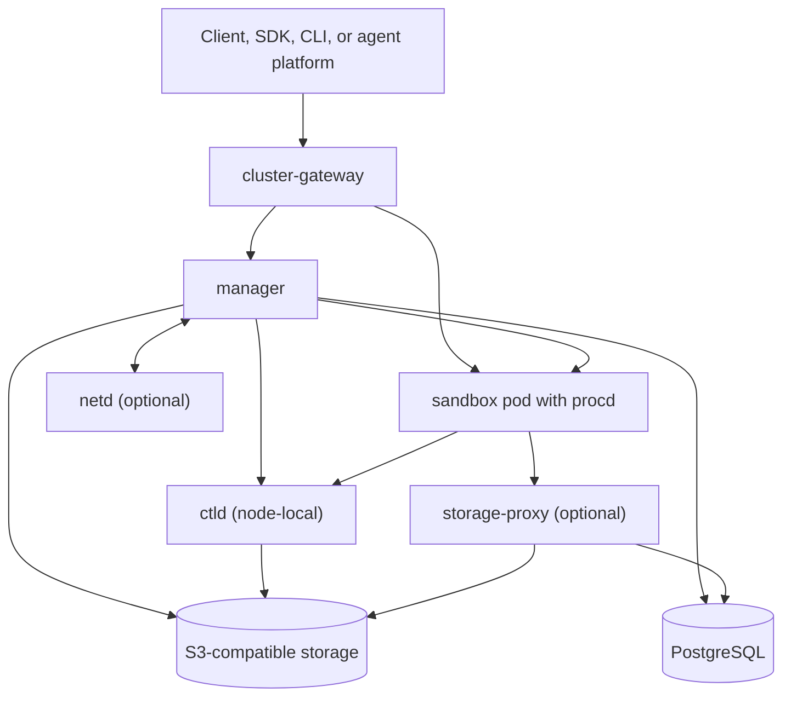

<p align="center">
  
</p>

<p align="center">
  <a href="https://sandbox0.ai/docs"></a>
  <a href="https://sandbox0.ai/docs/self-hosted"></a>
  <a href="./LICENSE"></a>
</p>

# Sandbox0

Sandbox0 is an open-source AI agent sandbox runtime for platforms that need to run untrusted code in persistent, policy-controlled Linux workspaces.

Each sandbox can provide an agent with a real execution environment: processes, files, optional volumes, service ports, network policy, and credential projection. Use Sandbox0 Cloud or self-host the control-plane and data-plane components for your own region.

Sandbox0 Cloud uses `https://api.sandbox0.ai` for sandboxes, templates, volumes, credentials, and team-scoped API keys.

> Sandbox0 is under active development. Prefer the SDKs and `s0` CLI over hardcoded HTTP paths, and check the docs before depending on beta surfaces.

## Built For

| You are building | The runtime problem | Sandbox0 gives you |
| --- | --- | --- |
| Coding agents and app builders | Every task needs a repo, shell, package manager, test runner, dev server, and preview URL. | Template-based sandboxes with commands, REPL contexts, files, services, and fast warm claims. |
| Code interpreters, evals, and security harnesses | Generated or user-submitted code must run with evidence, artifacts, and a constrained network. | Isolated execution, volume-backed artifacts, egress policy, credential boundaries, and usage records. |
| Agent products with long-lived sessions | Workspaces must survive idle time, resume later, branch for parallel work, and avoid idle compute as the source of truth. | Rootfs checkpoints, SandboxVolume, snapshots, forks, pause/resume, and `hard_ttl` cleanup. |
| Internal developer platforms | Agent work cannot all run on laptops, broad CI runners, or a public-only hosted sandbox. | Self-hosted Kubernetes data planes, regional storage boundaries, operator install, and usage truth. |

The important distinction is that Sandbox0 treats state, network, credentials, and usage as runtime primitives, not incidental files and side effects inside a disposable container.

## Runtime Model



The sandbox is the execution boundary, not the durable source of truth. Sandbox identity, rootfs checkpoints, volumes, policy, events, and usage records live outside the running process so a runtime pod can be paused, resumed, replaced, or deleted.

## Choose Your Path

| Path | Use it when | Start here |
| --- | --- | --- |
| **Raw Sandboxes** | You want direct control over processes, files, volumes, ports, templates, and network policy. | [Get started](https://sandbox0.ai/docs/get-started) |
| **Use Cases** | You want an agent framework gateway, browser automation API, or similar tool to run inside a sandbox, with state on a volume and its API exposed through Sandbox0 routes. | [Use Cases](https://sandbox0.ai/docs/use-cases) |
| **Self-hosted** | You need private deployment, data-plane ownership, regional storage boundaries, or custom runtime isolation. | [Self-hosted](https://sandbox0.ai/docs/self-hosted) |

## Quickstart

Install the `s0` CLI.

```bash
curl -fsSL https://raw.githubusercontent.com/sandbox0-ai/s0/main/scripts/install.sh | bash
```

Windows PowerShell:

```powershell
irm https://raw.githubusercontent.com/sandbox0-ai/s0/main/scripts/install.ps1 | iex
```

Sign in, then create a team-scoped API key for SDK or automation usage.

```bash
s0 auth login

# If no team is selected yet:
# s0 team list
# s0 team create --name my-team --home-region <region-id>
# s0 team use <team-id>

export SANDBOX0_TOKEN="$(s0 apikey create --name sdk-quickstart --role developer --expires-in 30d --raw)"
```

For Sandbox0 Cloud, SDKs default to `https://api.sandbox0.ai`. Set `SANDBOX0_BASE_URL` only when connecting to a self-hosted or private deployment.

Install an SDK. The Python SDK requires Python 3.9 or later, the TypeScript SDK requires Node.js 18 or later, and the Go SDK requires Go 1.25 or later.

```bash
# Python
pip install sandbox0

# TypeScript
npm install sandbox0

# Go
go get github.com/sandbox0-ai/sdk-go
```

Claim a sandbox, keep state in a REPL context, and run an isolated command.

```python
import os

from sandbox0 import Client
from sandbox0.apispec.models.sandbox_config import SandboxConfig

client = Client(
    token=os.environ["SANDBOX0_TOKEN"],
    base_url=os.environ.get("SANDBOX0_BASE_URL", "https://api.sandbox0.ai"),
)

with client.sandboxes.open(
    "default",
    config=SandboxConfig(ttl=300, hard_ttl=3600),
) as sandbox:
    sandbox.run("python", "x = 41")
    second = sandbox.run("python", "print(x + 1)")
    print(second.output_raw, end="")

    result = sandbox.cmd("/bin/sh -c 'pwd && ls -la'")
    print(result.output_raw, end="")
```

More examples:

- [Sandbox lifecycle and execution](https://sandbox0.ai/docs/sandbox)
- [Templates and warm pools](https://sandbox0.ai/docs/template)
- [Volumes, snapshots, fork, and sync](https://sandbox0.ai/docs/volume)
- [Network policy](https://sandbox0.ai/docs/sandbox/network)
- [Credentials and egress auth](https://sandbox0.ai/docs/credential)
- [GitHub CI integration](https://sandbox0.ai/docs/integrations/github-ci)
- [OpenAI Agents SDK integration](https://sandbox0.ai/docs/integrations/openai-agents)
- [Vercel Eve integration](https://sandbox0.ai/docs/integrations/vercel-eve)

## State And Persistence

| State | Where it lives | Survives pause/resume? | Use it for |
| --- | --- | --- | --- |
| Running process, memory, sockets | Runtime pod | No | Active tool calls, REPLs, dev servers, agent gateways |
| Writable root filesystem | Rootfs checkpoint tied to one sandbox identity | Yes, after checkpoint | Same-sandbox file continuity across idle pauses |
| Named rootfs snapshot | Snapshot of initialized rootfs state | Claimable by new sandboxes | Prepared repos, dependency installs, benchmark seeds, fan-out |
| SandboxVolume | Durable storage independent of one sandbox identity | Yes | Repos, caches, agent memory, artifacts, shared data, snapshots, forks |
| Metering, quota, and policy state | Control-plane storage | Yes | Usage truth, policy audit, quota, showback, and export |

`ttl` pauses idle runtime compute after checkpointing the writable root filesystem. `hard_ttl` deletes the sandbox identity and state tied to it. Long-running agents should treat the runtime as replaceable and put durable state in volumes, rootfs checkpoints, event logs, or external storage.

## Network And Credentials

Sandbox0 is designed for workloads that execute code the host should not trust.

- Network policy can default to block-all and allow only explicit destinations.
- `netd` enforces data-plane egress rules and protocol controls.
- Egress auth can project credentials at the network boundary instead of placing raw production keys in sandbox files or environment variables.
- SSH egress auth can proxy Git-over-SSH without writing the upstream private key into the sandbox.
- Sandbox Services enforce route auth, CORS, rate limits, timeouts, and path policy before public traffic reaches the sandbox.

Sandboxing reduces blast radius and gives policy a real enforcement point. It does not make prompt injection disappear. Isolation strength depends on your deployment choices, runtime class, CNI, storage, credential policy, and network defaults.

## Self-Hosted Architecture



Sandbox0 separates region-scoped control-plane services from cluster-scoped data-plane services. In single-cluster mode, `cluster-gateway` can act as the entrypoint. In multi-cluster mode, `regional-gateway` and `scheduler` select and route to one of the data-plane clusters in the same region.

| Layer | Components | Responsibility |
| --- | --- | --- |
| Control plane | Optional `regional-gateway`, optional `scheduler` | Tenant/API key management, cluster selection, internal routing, template distribution |
| Data plane | `cluster-gateway`, `manager`, `ctld`, optional `storage-proxy`, optional `netd` | Sandbox lifecycle, rootfs checkpoints, process/file APIs, volume storage, network enforcement |
| In-pod runtime | `procd` | PID 1 inside each sandbox pod, process abstraction, file I/O, volume mount operations |
| Storage | PostgreSQL plus S3-compatible object storage | Metadata, usage truth, events, rootfs/volume data |

Self-hosting is operator-first:

1. Install `infra-operator`.
2. Apply a `Sandbox0Infra` resource.
3. Let the operator reconcile gateways, manager, storage, networking, and supporting services.

Start here: <https://sandbox0.ai/docs/self-hosted>

## Repository Boundary

This repository contains the core Sandbox0 control plane, data plane, API contract, Kubernetes operator, runtime components, and docs.

Open-source `sandbox0` owns runtime primitives, metering, usage truth, API spec, and deployable components. Billing, pricing, invoices, payments, and closed cloud workflows belong outside this repository.

Related repositories:

- CLI: <https://github.com/sandbox0-ai/s0>
- Go SDK: <https://github.com/sandbox0-ai/sdk-go>
- JavaScript/TypeScript SDK: <https://github.com/sandbox0-ai/sdk-js>
- Python SDK: <https://github.com/sandbox0-ai/sdk-py>

For API changes, `pkg/apispec/openapi.yaml` is the source of truth. Generated SDK code and copied OpenAPI files in other repositories should be synchronized from it rather than edited by hand.

## Known Boundaries

- Sandbox0 is a runtime boundary, not a complete agent framework. Bring your own harness or use the documented use-case templates when you want a framework gateway to live inside the sandbox boundary.
- Pause/resume does not preserve live processes, sockets, or memory. Runtime requests are routed to a committed generation; during lifecycle transitions they may wait for the transaction to commit and continue after resume.
- Self-hosted production installs require deliberate choices for Kubernetes runtime isolation, CNI, PostgreSQL, S3-compatible storage, registry, ingress, and credential policy.
- Browser and computer-use workloads require templates and integrations that include the browser/runtime tools you need.
- Do not hand-edit generated OpenAPI or SDK output. Update `sandbox0/pkg/apispec/openapi.yaml`, regenerate, and synchronize.

## Contributing

Bug reports should include a minimal reproduction, relevant logs, Sandbox0 version or deployment mode, and whether the issue is on Cloud or self-hosted. Remove API keys, tokens, kubeconfigs, private repository URLs, customer data, and any other sensitive information before sharing logs.

Sandbox0 is Apache-2.0 licensed. See [LICENSE](./LICENSE).
