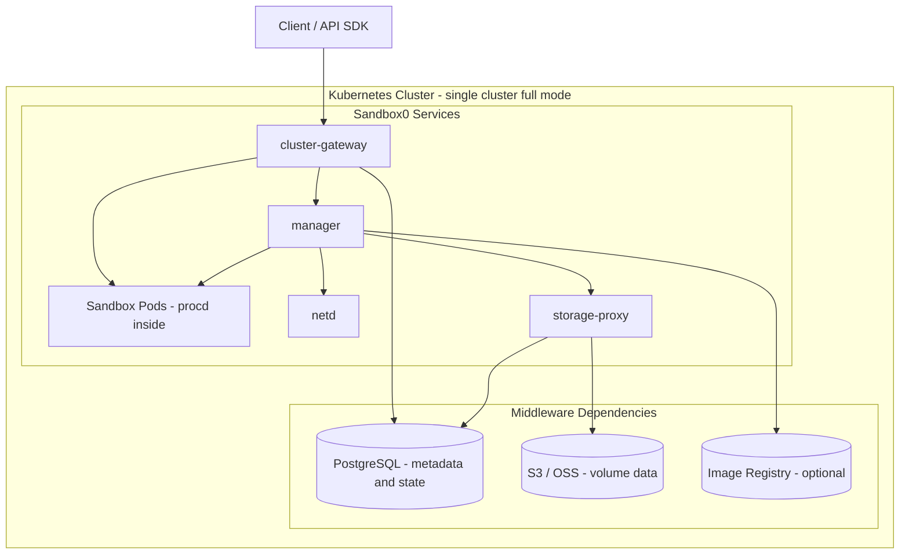

<p align="center">
  
</p>

<p align="center">
  <a href="https://sandbox0.ai/docs"></a>
  <a href="https://sandbox0.ai/docs/self-hosted"></a>
  <a href="./LICENSE"></a>
</p>

> Note: Sandbox0 is under rapid iteration. Before the SaaS offering launches, backward compatibility is not guaranteed.

Sandbox0 is a general-purpose sandbox for building AI Agents. You can set any Docker image as a custom template image.

Key features of Sandbox0:
- Hot Sandbox Pool: Pre-creates idle Pods for millisecond-level startup times.
- Persistent Storage: Persistent Volumes based on s0fs, supporting snapshot/restore/fork.
- Network Control: manager applies template-namespace ingress baseline isolation, and netd implements node-level L4/L7 runtime policy enforcement.
- Egress Auth: outbound credentials can be resolved and injected on the egress path, so raw secret material does not need to live inside the sandbox process.
- Process Management: procd acts as the sandbox's PID=1, supporting REPL processes requiring session persistence (e.g., bash, python, node, redis-cli) and one-time Cmd processes.
- Self-hosting Friendly: Complete private deployment solution.
- Modular Installation: From a minimal mode with only 2 services to a single-cluster full mode, and multi-cluster horizontal scaling.

It can serve as an E2B alternative, suitable for general agents, coding agents, browser agents, and other scenarios.

## What Makes It Different

- Warm sandbox pools managed by `manager`, so agent claims can come from pre-created idle pods instead of waiting for a fresh boot on every task.
- `procd` inside each sandbox pod, giving Sandbox0 a first-class runtime for command execution, stateful contexts, file I/O, directory watches, and webhook-triggered workflows.
- Sandbox0 REPL contexts are a unified abstraction for interactive runtimes, so the same interface can back shells, language interpreters, database consoles, and custom REPLs, for example `bash`, `python`, `sqlite`, or `redis-cli`.
- Persistent volumes decoupled from sandbox lifetime through `storage-proxy`, so agent workspaces, caches, checkpoints, and generated artifacts can outlive any single pod.
- Snapshot, restore, and fork-oriented volume workflows built on s0fs plus object storage and PostgreSQL metadata, which is exactly what long-running agent systems need for recovery and reuse.
- Manager-owned template namespace ingress baselines, so sandbox pods in the same template namespace do not accept peer traffic by default even before runtime egress policy is considered.
- Node-level network control through `netd`, which watches sandbox policy, transparently redirects traffic, and applies L4/L7 enforcement close to the workload.
- Egress auth that resolves credential bindings outside the sandbox and injects outbound auth at the network edge, which is a safer fit for untrusted agent code than placing raw API keys or client certificates in the sandbox environment.
- Runtime-agnostic sandboxing via template `runtimeClassName`, so the same system can run on a standard Kubernetes runtime in development and move to stronger isolation such as gVisor or Kata in production.
- A deployment model that scales from a simple single-cluster setup to multi-cluster regional routing with `regional-gateway` and `scheduler`.
- Operator-first lifecycle management, so installation, reconciliation, and upgrades follow a repeatable Kubernetes-native path instead of bespoke scripts.

### Architecture



Most users start with a single-cluster deployment and only move to multi-cluster when they need regional scale-out. For deeper architecture and deployment details, see <https://sandbox0.ai/docs/self-hosted>.

In multi-region deployments backed by `global-gateway`, every team creation path must provide an explicit `home_region_id` so the team's routing target is unambiguous from the start.

## Claim A Sandbox

All examples below assume:

- `SANDBOX0_TOKEN` contains a valid API token
- `SANDBOX0_BASE_URL` optionally overrides the default endpoint for self-hosted deployments

### Python

Install:

```bash
pip install sandbox0
```

```python
import os

from sandbox0 import Client
from sandbox0.apispec.models.sandbox_config import SandboxConfig

client = Client(
    token=os.environ["SANDBOX0_TOKEN"],
    base_url=os.environ.get("SANDBOX0_BASE_URL", "http://localhost:30080"),
)

with client.sandboxes.open(
    "default",
    config=SandboxConfig(ttl=300, hard_ttl=3600),
) as sandbox:
    print(f"Sandbox ID: {sandbox.id}")
    print(f"Status: {sandbox.status}")
```

For Go, TypeScript, CLI, and full getting-started guides, see <https://sandbox0.ai/docs/get-started>.

## Self-Hosted Quickstart

The example below is a minimal `kind` installation for local evaluation.

Prerequisites:

- `kind`
- `kubectl`
- `helm`

Create a local cluster with the same Kind config used by `infra/tests/e2e`:

```bash
kind create cluster --config kind-config.yaml
```

`kind-config.yaml`:

```yaml
kind: Cluster
apiVersion: kind.x-k8s.io/v1alpha4
name: sandbox0
nodes:
- role: control-plane
  image: kindest/node:v1.35.0
  kubeadmConfigPatches:
  - |
    kind: ClusterConfiguration
    apiServer:
      extraArgs:
        enable-aggregator-routing: "true"
  extraPortMappings:
  # cluster-gateway HTTP port
  - containerPort: 30080
    hostPort: 30080
  # registry port for template image push
  - containerPort: 30500
    hostPort: 30500
```

Install `infra-operator`:

```bash
helm repo add sandbox0 https://charts.sandbox0.ai
helm repo update

helm install infra-operator sandbox0/infra-operator \
    --namespace sandbox0-system \
    --create-namespace
```

Apply the minimal single-cluster sample:

It does not include `netd` or `storage-proxy`, so it does not provide netd-backed egress enforcement or volume capabilities. Template-namespace ingress baselines still depend on Kubernetes `NetworkPolicy` support in your CNI.

```bash
kubectl apply -f https://raw.githubusercontent.com/sandbox0-ai/sandbox0/main/infra-operator/chart/samples/single-cluster/minimal.yaml
kubectl get sandbox0infra -n sandbox0-system -w
```

Get the initial admin credentials:

```bash
ADMIN_PASSWORD="$(kubectl get secret admin-password -n sandbox0-system -o jsonpath='{.data.password}' | base64 -d)"
printf 'username: %s\npassword: %s\n' 'admin@example.com' "$ADMIN_PASSWORD"
```

Configure the local API URL and create a token:

The local `kind` setup above exposes `cluster-gateway` at `http://localhost:30080`.

```bash
export SANDBOX0_BASE_URL="http://localhost:30080"

s0 auth login

unset SANDBOX0_TOKEN && export SANDBOX0_TOKEN="$(s0 apikey create --name test-apikey --role admin --expires-in 30d --raw)"
```

## Production Notes

- `kind` is for evaluation only and is not a production deployment shape.
- Most teams should start with the operator-managed single-cluster setup.
- Full architecture, configuration, and production deployment guidance live in the self-hosted docs.

For full deployment guidance, see <https://sandbox0.ai/docs/self-hosted>.
