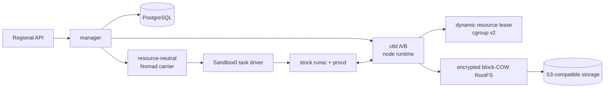

<p align="center">
  
</p>

<p align="center">
  <a href="https://sandbox0.ai/docs"></a>
  <a href="https://sandbox0.ai/docs/self-hosted"></a>
  <a href="./LICENSE"></a>
</p>

# Sandbox0

**Persistent, encrypted sandboxes for long-running AI agents, scheduled by Nomad and isolated by gVisor.**

Sandbox0 is an open-source runtime for platforms that need to execute untrusted
code without treating every workspace as disposable. A physical runtime
allocation is replaceable; the sandbox identity and writable RootFS are
durable.

Sandbox0 Cloud uses `https://api.sandbox0.ai` for sandboxes, templates,
credentials, and team-scoped API keys.

> Sandbox0 is under active development. Prefer the SDKs and `s0` CLI over
> hardcoded HTTP paths, and check the docs before depending on beta surfaces.

## Why Sandbox0

| Differentiator | What it means |
| --- | --- |
| **Storage and compute are separated** | Writable RootFS generations are application-encrypted and stored in S3-compatible object storage. Compute nodes keep disposable caches, not the durable source of truth. |
| **The sandbox lifetime is policy-controlled** | `ttl` and `hard_ttl` default to `0` (disabled). Pause idle compute and later resume the same sandbox identity, or keep it running. |
| **gVisor isolation** | Stock `runsc` provides a per-sandbox application-kernel boundary on dedicated Nomad client nodes. |
| **One resource-neutral warm pool** | Warm Nomad carrier allocations are compatible by immutable runtime properties, not CPU or memory size. Claim-time CPU and memory are leased atomically from node capacity. |
| **Durable environment reuse** | Snapshot, restore, fork, and template-from-sandbox use immutable block-COW RootFS generations rather than republishing mutable workspace state as an image. |

## Quickstart

Install the `s0` CLI:

```bash
curl -fsSL https://raw.githubusercontent.com/sandbox0-ai/s0/main/scripts/install.sh | bash
```

Windows PowerShell:

```powershell
irm https://raw.githubusercontent.com/sandbox0-ai/s0/main/scripts/install.ps1 | iex
```

Sign in and create a team-scoped API key:

```bash
s0 auth login

# If no team is selected yet:
# s0 team list
# s0 team create --name my-team --home-region <region-id>
# s0 team use <team-id>

export SANDBOX0_TOKEN="$(s0 apikey create --name sdk-quickstart --role developer --expires-in 30d --raw)"
```

SDKs default to `https://api.sandbox0.ai`. Set `SANDBOX0_BASE_URL` only for a
self-hosted or private deployment.

```bash
# Python 3.9+
pip install sandbox0

# Node.js 18+
npm install sandbox0

# Go 1.25+
go get github.com/sandbox0-ai/sdk-go
```

Claim a sandbox, keep state in a REPL context, and run an isolated command:

```python
import os

from sandbox0 import Client
from sandbox0.apispec.models.sandbox_config import SandboxConfig

client = Client(
    token=os.environ["SANDBOX0_TOKEN"],
    base_url=os.environ.get("SANDBOX0_BASE_URL", "https://api.sandbox0.ai"),
)

with client.sandboxes.open(
    "default",
    config=SandboxConfig(ttl=300, hard_ttl=3600),
) as sandbox:
    sandbox.run("python", "x = 41")
    second = sandbox.run("python", "print(x + 1)")
    print(second.output_raw, end="")

    result = sandbox.cmd("/bin/sh -c 'pwd && ls -la'")
    print(result.output_raw, end="")
```

More examples:

- [Sandbox lifecycle and execution](https://sandbox0.ai/docs/sandbox)
- [Templates and the unified warm pool](https://sandbox0.ai/docs/template)
- [RootFS snapshots, restore, and fork](https://sandbox0.ai/docs/sandbox/snapshot-restore)
- [Network policy](https://sandbox0.ai/docs/sandbox/network)
- [Credentials and egress auth](https://sandbox0.ai/docs/credential)
- [Self-hosted deployment](https://sandbox0.ai/docs/self-hosted)

## Runtime And Storage Model


```mermaid
flowchart LR
    api["Regional API"] --> manager["manager"]
    manager --> pg[("PostgreSQL")]
    manager --> slot["resource-neutral<br/>Nomad carrier"]
    manager --> ctld["ctld A/B<br/>node runtime"]
    ctld --> lease["dynamic resource lease<br/>cgroup v2"]
    slot --> driver["Sandbox0 task driver"]
    driver --> runsc["stock runsc + procd"]
    runsc <--> ctld
    ctld --> rootfs["encrypted block-COW RootFS"]
    rootfs --> object[("S3-compatible storage")]
```

Nomad schedules dedicated Sandbox0 nodes and resource-neutral carrier
allocations. On claim, manager and PostgreSQL atomically select a ready slot
and lease exact node CPU and memory. `ctld` creates the dynamic cgroup and
prepares RootFS and network state; the task driver then writes the committed
lease into the OCI spec and starts stock `runsc`.

CPU and memory are deliberately absent from the warm-slot compatibility key.
Compatibility classes contain only immutable execution properties such as
architecture, runsc version and platform, DirectFS/file-access mode, RootFS
format, and security class.

| State | Durable? | Location |
| --- | --- | --- |
| Running processes, memory, sockets | No | Current gVisor runtime allocation |
| Writable RootFS | Yes, after a committed checkpoint | Encrypted regional S3-compatible storage |
| Named RootFS snapshot | Yes | Immutable block-COW generation |
| Lifecycle, capacity leases, policy, and metering producer state | Yes | Regional PostgreSQL |
| Historical metering read model | Rebuildable | ClickHouse projection from the PostgreSQL outbox |

Pause checkpoints the exact writable RootFS and releases runtime compute.
Resume creates a new runtime generation for the same sandbox identity. Live
processes, memory, and sockets are intentionally not checkpointed.

## Self-Hosted Architecture

Sandbox0 separates region-scoped control services from cluster-scoped data
planes. One region may contain several data-plane clusters that share the
region's PostgreSQL and S3 authorities.

| Layer | Components | Responsibility |
| --- | --- | --- |
| Region control plane | `regional-gateway`, optional `scheduler` | Identity, routing, template authority, and multi-cluster selection |
| Data-plane control | `cluster-gateway`, `manager`, `ssh-gateway` | Sandbox APIs, lifecycle, RootFS metadata, and node authority |
| Dedicated Nomad nodes | `ctld-a`, `ctld-b`, `nomad-driver-sandbox0`, stock `runsc` | Capacity, cgroups, RootFS, network policy, runtime creation, and terminal proof |
| Sandbox runtime | `procd` inside `runsc` | Commands, REPL contexts, files, services, and events |
| Regional stores | PostgreSQL, S3-compatible object storage, optional ClickHouse | Transactional truth, encrypted RootFS, and metering query projection |

Self-hosting uses direct host services or Nomad service jobs for control
services and direct systemd units for node-local `ctld` A/B. Start with
[`deploy/nomad/README.md`](deploy/nomad/README.md).

## Repository Boundary

This repository contains the Sandbox0 control services, Nomad task driver,
node runtime, public API contract, metering producer, deployment assets, and
docs. Billing, pricing, invoices, and payments belong outside this repository.

Related repositories:

- CLI: <https://github.com/sandbox0-ai/s0>
- Go SDK: <https://github.com/sandbox0-ai/sdk-go>
- JavaScript/TypeScript SDK: <https://github.com/sandbox0-ai/sdk-js>
- Python SDK: <https://github.com/sandbox0-ai/sdk-py>

`pkg/apispec/openapi.yaml` is the only OpenAPI source of truth. Generated code
and SDK copies must be synchronized from it rather than edited by hand.

## Known Boundaries

- Sandbox0 is a runtime boundary, not an agent framework.
- Pause/resume preserves durable RootFS state, not processes, sockets, or memory.
- Production nodes must be dedicated to Sandbox0. Nomad carrier resources cover
  driver overhead only and are not sandbox CPU or memory limits.
- Production acceptance requires truthful physical capacity, multi-node failure
  tests, and security gates. Do not report a narrower local run as an eight-way
  production result.
- Browser and computer-use workloads need templates that include their runtime
  dependencies.
- Do not hand-edit generated OpenAPI or SDK output.

## Contributing

Bug reports should include a minimal reproduction, relevant logs, Sandbox0
version or topology, and whether the deployment is Cloud or self-hosted. Remove
API keys, tokens, private endpoints, customer data, and credentials before
sharing logs.

Sandbox0 is Apache-2.0 licensed. See [LICENSE](./LICENSE).
