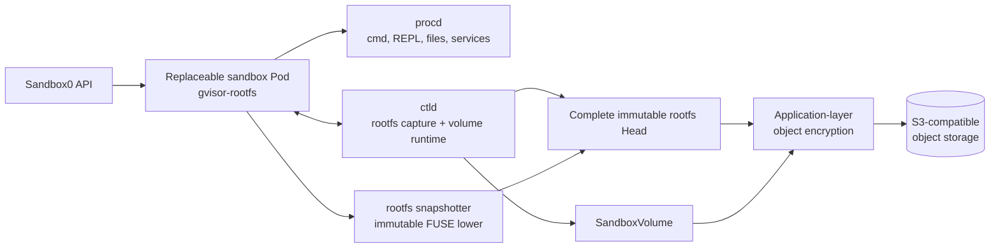
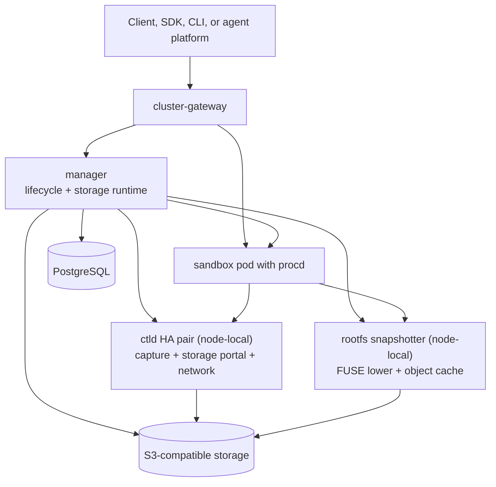

<p align="center">
  
</p>

<p align="center">
  <a href="https://sandbox0.ai/docs"></a>
  <a href="https://sandbox0.ai/docs/self-hosted"></a>
  <a href="./LICENSE"></a>
</p>

# Sandbox0

**Persistent, encrypted, Kubernetes-native sandboxes for long-running AI agents.**

Sandbox0 is an open-source runtime for platforms that need to run untrusted code without treating every workspace as a disposable container. The runtime pod is replaceable; the sandbox identity, writable rootfs checkpoints, and SandboxVolume data are durable.

Sandbox0 Cloud uses `https://api.sandbox0.ai` for sandboxes, templates, volumes, credentials, and team-scoped API keys.

> Sandbox0 is under active development. Prefer the SDKs and `s0` CLI over hardcoded HTTP paths, and check the docs before depending on beta surfaces.

## Why Sandbox0

| Differentiator | What it means |
| --- | --- |
| **Storage and compute are separated** | Persisted rootfs checkpoints and SandboxVolume objects are application-encrypted and stored in horizontally scalable S3-compatible object storage. Sandbox worker nodes keep disposable caches, not the durable source of truth. |
| **The sandbox lifetime is your policy** | `ttl` and `hard_ttl` both default to `0` (disabled), so the API imposes no fixed execution window. Keep a runtime running, or pause idle compute and resume the same sandbox identity later. |
| **One hardened runtime path** | Sandbox Pods use the operator-managed `gvisor-rootfs` RuntimeClass. Its `runsc` handler uses the Sandbox0 external snapshotter, so isolation and persistent rootfs behavior do not diverge across runtime families. |
| **Fast starts, warm or cold** | Ready template pools make common claims a metadata handoff instead of a Pod boot. When a pool is empty, the cold path avoids a per-Pod init copy by mounting `procd` from a small OCI artifact and can work with cloud node autoscaling. |
| **Small-file performance is measured** | The checked-in SandboxVolume suite covers 30,000-file writes, content-verified reads, metadata operations, destruction, reattachment, and byte-for-byte durability instead of relying on a storage bandwidth claim. |

## Quickstart

Install the `s0` CLI.

```bash
curl -fsSL https://raw.githubusercontent.com/sandbox0-ai/s0/main/scripts/install.sh | bash
```

Windows PowerShell:

```powershell
irm https://raw.githubusercontent.com/sandbox0-ai/s0/main/scripts/install.ps1 | iex
```

Sign in, then create a team-scoped API key for SDK or automation usage.

```bash
s0 auth login

# If no team is selected yet:
# s0 team list
# s0 team create --name my-team --home-region <region-id>
# s0 team use <team-id>

export SANDBOX0_TOKEN="$(s0 apikey create --name sdk-quickstart --role developer --expires-in 30d --raw)"
```

For Sandbox0 Cloud, SDKs default to `https://api.sandbox0.ai`. Set `SANDBOX0_BASE_URL` only when connecting to a self-hosted or private deployment.

Install an SDK. The Python SDK requires Python 3.9 or later, the TypeScript SDK requires Node.js 18 or later, and the Go SDK requires Go 1.25 or later.

```bash
# Python
pip install sandbox0

# TypeScript
npm install sandbox0

# Go
go get github.com/sandbox0-ai/sdk-go
```

Claim a sandbox, keep state in a REPL context, and run an isolated command.

```python
import os

from sandbox0 import Client
from sandbox0.apispec.models.sandbox_config import SandboxConfig

client = Client(
    token=os.environ["SANDBOX0_TOKEN"],
    base_url=os.environ.get("SANDBOX0_BASE_URL", "https://api.sandbox0.ai"),
)

with client.sandboxes.open(
    "default",
    config=SandboxConfig(ttl=300, hard_ttl=3600),
) as sandbox:
    sandbox.run("python", "x = 41")
    second = sandbox.run("python", "print(x + 1)")
    print(second.output_raw, end="")

    result = sandbox.cmd("/bin/sh -c 'pwd && ls -la'")
    print(result.output_raw, end="")
```

More examples:

- [Sandbox lifecycle and execution](https://sandbox0.ai/docs/sandbox)
- [Templates and warm pools](https://sandbox0.ai/docs/template)
- [Volumes, snapshots, fork, and sync](https://sandbox0.ai/docs/volume)
- [Network policy](https://sandbox0.ai/docs/sandbox/network)
- [Credentials and egress auth](https://sandbox0.ai/docs/credential)
- [GitHub CI integration](https://sandbox0.ai/docs/integrations/github-ci)
- [OpenAI Agents SDK integration](https://sandbox0.ai/docs/integrations/openai-agents)
- [Vercel Eve integration](https://sandbox0.ai/docs/integrations/vercel-eve)

## Storage, Encryption, And Long-Running Sandboxes


```mermaid
flowchart LR
    api["Sandbox0 API"] --> pod["Replaceable sandbox Pod<br/>gvisor-rootfs"]
    pod --> procd["procd<br/>cmd, REPL, files, services"]
    pod <--> ctld["ctld<br/>rootfs capture + volume runtime"]
    pod --> snapshotter["rootfs snapshotter<br/>immutable FUSE lower"]
    ctld --> rootfs["Complete immutable rootfs Head"]
    snapshotter --> rootfs
    ctld --> volume["SandboxVolume"]
    rootfs --> encryption["Application-layer<br/>object encryption"]
    volume --> encryption
    encryption --> object[("S3-compatible<br/>object storage")]
```

| State | Where it lives | Survives pause/resume? | Use it for |
| --- | --- | --- | --- |
| Running process, memory, sockets | Runtime pod | No | Active tool calls, REPLs, dev servers, agent gateways |
| Writable root filesystem | Rootfs checkpoint tied to one sandbox identity | Yes, after checkpoint | Same-sandbox file continuity across idle pauses |
| Named rootfs snapshot | Snapshot of initialized rootfs state | Claimable by new sandboxes | Prepared repos, dependency installs, benchmark seeds, fan-out |
| SandboxVolume | Durable storage independent of one sandbox identity | Yes | Repos, caches, agent memory, artifacts, shared data, snapshots, forks |
| Metering, quota, and policy state | Control-plane storage | Yes | Usage truth, policy audit, quota, showback, and export |

By default, Sandbox0 applies envelope encryption to persisted rootfs checkpoint objects and S0FS Volume objects before writing them to S3-compatible storage. This is service-side rather than end-to-end encryption: `manager`, the active `ctld`, and the rootfs snapshotter hold the installation key and can decrypt objects while serving sandbox operations. Self-hosted deployments control this behavior with `spec.storage.runtime.objectEncryptionEnabled`.

During execution, `ctld` continuously persists changes from the native overlayfs upper into a complete immutable Head. Pause freezes user processes, reconciles only the dirty tail when the watcher is healthy, and publishes the Head transactionally before releasing the Pod. Resume attaches that Head as a lazy, read-only FUSE lower beneath a fresh native overlay upper. Running processes, memory, and sockets are intentionally not checkpointed.

This model lets storage capacity scale independently of compute nodes and lets long-running agents survive idle periods, node replacement, and runtime restarts. Set `ttl` to pause idle compute, set `hard_ttl` when you need a cleanup deadline, or leave either value at `0` to disable that expiration path.

## Why Kubernetes + gVisor Instead Of A Firecracker-First Stack

[Firecracker](https://github.com/firecracker-microvm/firecracker) is excellent microVM technology. Its KVM boundary is a strong choice when hardware virtualization is the primary requirement. Sandbox0 deliberately optimizes for a different systems boundary: multi-tenant isolation that fits directly into managed Kubernetes and preserves containerd-native rootfs lifecycle operations.

| Goal | Sandbox0's Kubernetes + gVisor approach |
| --- | --- |
| **Use the cloud's managed control plane** | Major clouds already operate Kubernetes as a managed service: [Amazon EKS](https://docs.aws.amazon.com/eks/latest/userguide/what-is-eks.html), [Google GKE](https://cloud.google.com/kubernetes-engine/docs/concepts/kubernetes-engine-overview), [Azure AKS](https://learn.microsoft.com/en-us/azure/aks/core-aks-concepts), and [Alibaba Cloud ACK](https://www.alibabacloud.com/help/en/ack/product-overview/product-introduction). Sandbox0 can use their cluster lifecycle, version upgrades, node pools, networking integrations, and horizontal node autoscaling instead of building a separate microVM control plane. |
| **Add a multi-tenant isolation layer** | [gVisor](https://gvisor.dev/docs/architecture_guide/intro/) handles guest system calls in a per-sandbox application kernel, reducing direct exposure to the host Linux kernel while retaining the Pod resource model. |
| **Keep deployment portable** | `runsc` integrates with [Kubernetes and containerd](https://gvisor.dev/docs/user_guide/quick_start/kubernetes/) through a `RuntimeClass`. Sandbox0 keeps one `gvisor-rootfs` handler across supported self-managed Kubernetes environments. |
| **Scale with ordinary Kubernetes primitives** | Sandbox workloads remain Pods, so the scheduler, quotas, node pools, rolling upgrades, observability, and cluster autoscaler stay on the normal operational path. |
| **Persist and restore the writable rootfs** | Sandbox0's `gvisor-rootfs` handler uses the Sandbox0 external snapshotter: a native overlay upper stays on the write path while immutable encrypted Heads are attached lazily as FUSE lowers. |

This is a tradeoff, not a claim that gVisor has a stronger isolation boundary than a Firecracker microVM. Sandbox0 chooses gVisor when teams want a substantial isolation layer without giving up managed Kubernetes operations, elastic Pod scheduling, or containerd-backed rootfs pause/resume.

## Reproducible SandboxVolume Performance

S0FS is Sandbox0's S3-backed filesystem for durable SandboxVolumes. It batches small writes into object-storage-friendly segments while presenting a normal mounted filesystem to the sandbox.

The checked-in online benchmark was run in a production `gVisor` sandbox in `ali-ue1`:

| Workload | S0FS result |
| --- | ---: |
| Destroy producer, reattach to a fresh sandbox, verify 30,000 x 4 KiB files | 30,000 files and 122,880,000 bytes verified; 0 missing, corrupt, or unexpected files |
| Eight-worker 30,000 x 4 KiB write | 903 files/s |
| Eight-worker immediate full-content read and verify | 1,566 files/s |
| Recursive list plus stat | 7,681 operations/s |
| Historical `mdtest` geometry, file operations only | 1.26-2.57x the historical JuiceFS-published rates and 8.33-18.21x the historical EFS-published rates |

These results are transparent baselines, not an SLA or a current cross-provider leaderboard. The JuiceFS and EFS values are historical, cross-environment references. See the [benchmark standard](./scripts/SANDBOX_VOLUME_BENCHMARK_STANDARD.md), [verified 4 KiB results](./scripts/VOLUME_SMALL_FILE_BENCHMARK.md), [historical mdtest comparison](./scripts/VOLUME_MDTEST_BENCHMARK.md), and runnable scripts in [`scripts/`](./scripts/).

## Isolation, Network, And Credentials

Sandbox0 also provides the expected policy surfaces for untrusted code: selectable runtime isolation, default-deny egress rules, protocol controls, credential projection at the network boundary, Git-over-SSH credential proxying, and authenticated public services with CORS, rate limits, timeouts, and path policy.

Sandboxing reduces blast radius and gives policy a real enforcement point. It does not make prompt injection disappear. Isolation strength depends on your deployment choices, runtime class, CNI, storage, credential policy, and network defaults.

## Self-Hosted Architecture


```mermaid
flowchart TB
    client["Client, SDK, CLI, or agent platform"] --> cgw["cluster-gateway"]
    cgw --> mgr["manager<br/>lifecycle + storage runtime"]
    cgw --> pod["sandbox pod with procd"]
    mgr --> pod
    mgr --> ctld["ctld HA pair (node-local)<br/>capture + storage portal + network"]
    mgr --> snapshotter["rootfs snapshotter (node-local)<br/>FUSE lower + object cache"]
    pod --> ctld
    pod --> snapshotter
    mgr --> pg[("PostgreSQL")]
    mgr --> s3[("S3-compatible storage")]
    ctld --> s3
    snapshotter --> s3
```

Sandbox0 separates region-scoped control-plane services from cluster-scoped data-plane services. In single-cluster mode, `cluster-gateway` can act as the entrypoint. In multi-cluster mode, `regional-gateway` and `scheduler` select and route to one of the data-plane clusters in the same region.

`manager` owns sandbox lifecycle, PostgreSQL Head publication, and the storage API runtime. Each sandbox node runs the `ctld-a` and `ctld-b` HA pair for continuous upper capture, volume portals, and network policy, plus one external rootfs snapshotter that owns live FUSE lowers and the shared disk cache.

| Layer | Components | Responsibility |
| --- | --- | --- |
| Control plane | Optional `regional-gateway`, optional `scheduler` | Tenant/API key management, cluster selection, internal routing, template distribution |
| Data plane | `cluster-gateway`, `manager`, `ctld-a` / `ctld-b`, rootfs snapshotter | Sandbox lifecycle, rootfs capture and lazy restore, process/file APIs, volume storage, network enforcement |
| In-pod runtime | `procd` | PID 1 inside each sandbox pod, process abstraction, file I/O, volume mount operations |
| Storage | PostgreSQL, ClickHouse, and S3-compatible object storage | Transactional state and metering producer state/outbox in PostgreSQL, asynchronous metering query projection in ClickHouse, encrypted rootfs/volume objects in S3 |

Self-hosting is operator-first:

1. Install `infra-operator`.
2. Apply a `Sandbox0Infra` resource.
3. Let the operator reconcile gateways, manager, storage, networking, and supporting services.

Start here: <https://sandbox0.ai/docs/self-hosted>

## Repository Boundary

This repository contains the core Sandbox0 control plane, data plane, API contract, Kubernetes operator, runtime components, and docs.

Open-source `sandbox0` owns runtime primitives, metering, usage truth, API spec, and deployable components. Billing, pricing, invoices, payments, and closed cloud workflows belong outside this repository.

Related repositories:

- CLI: <https://github.com/sandbox0-ai/s0>
- Go SDK: <https://github.com/sandbox0-ai/sdk-go>
- JavaScript/TypeScript SDK: <https://github.com/sandbox0-ai/sdk-js>
- Python SDK: <https://github.com/sandbox0-ai/sdk-py>

For API changes, `pkg/apispec/openapi.yaml` is the source of truth. Generated SDK code and copied OpenAPI files in other repositories should be synchronized from it rather than edited by hand.

## Known Boundaries

- Sandbox0 is a runtime boundary, not a complete agent framework. Bring your own harness or use the documented use-case templates when you want a framework gateway to live inside the sandbox boundary.
- Pause/resume does not preserve live processes, sockets, or memory. Runtime requests are routed to a committed generation; during lifecycle transitions they may wait for the transaction to commit and continue after resume.
- Cold-claim latency includes Kubernetes scheduling, CNI setup, image locality, and, when necessary, node provisioning.
- `infra-operator` creates the `gvisor-rootfs` RuntimeClass, but self-hosted operators must install `runsc`, configure its containerd handler and `sandbox0` snapshotter proxy, and restart containerd on every sandbox node.
- SandboxVolume numbers above are measured baselines, not an availability or performance SLA. Historical JuiceFS/EFS comparisons are not current same-environment provider tests.
- Self-hosted production installs require deliberate choices for Kubernetes runtime isolation, CNI, PostgreSQL, S3-compatible storage, registry, ingress, and credential policy.
- Browser and computer-use workloads require templates and integrations that include the browser/runtime tools you need.
- Do not hand-edit generated OpenAPI or SDK output. Update `sandbox0/pkg/apispec/openapi.yaml`, regenerate, and synchronize.

## Contributing

Bug reports should include a minimal reproduction, relevant logs, Sandbox0 version or deployment topology, and whether the issue is on Cloud or self-hosted. Remove API keys, tokens, kubeconfigs, private repository URLs, customer data, and any other sensitive information before sharing logs.

Sandbox0 is Apache-2.0 licensed. See [LICENSE](./LICENSE).
