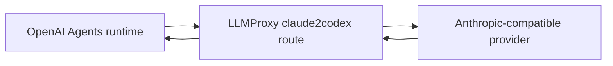

# LLMProxy

LLMProxy is a protocol translation layer for model providers. It is useful when the agent engine expects one API shape, but the model provider exposes another API shape.

In Managed Agents, the most common case is `openai-agents`: the engine uses the OpenAI Agents SDK and expects an OpenAI Responses-compatible endpoint. Some model providers expose an Anthropic-compatible Messages endpoint instead. LLMProxy can translate between those surfaces.

## When To Use It

Use LLMProxy when:

- The selected engine is `openai-agents` or another OpenAI-compatible runtime.
- The model provider exposes an Anthropic-compatible endpoint.
- You want to keep using Sandbox0 LLM vaults for token storage and credential projection.

Do not add LLMProxy just because a provider is non-OpenAI. If the selected engine is `claude` and the provider already exposes an Anthropic-compatible endpoint, point the LLM vault directly at that provider.

## URL Shape

The hosted Sandbox0 LLMProxy supports `claude2codex`, which presents an OpenAI Responses-compatible surface to the client and forwards to an Anthropic-compatible upstream.

Start with the provider's Anthropic-compatible base URL:

```text
https://api.z.ai/api/anthropic
```

Prefix it with the LLMProxy route:

```text
https://llmproxy.sandbox0.ai/claude2codex/https://api.z.ai/api/anthropic
```

Use that full URL as `sandbox0.managed_agents.llm_base_url` on the LLM vault.

## OpenAI Agents Example

```typescript
const llmVault = await client.beta.vaults.create({
    display_name: "OpenAI Agents via LLMProxy",
    metadata: {
        "sandbox0.managed_agents.role": "llm",
        "sandbox0.managed_agents.engine": "openai-agents",
        "sandbox0.managed_agents.llm_base_url": "https://llmproxy.sandbox0.ai/claude2codex/https://api.z.ai/api/anthropic",
    },
});

await client.beta.vaults.credentials.create(llmVault.id, {
    display_name: "Model provider API key",
    auth: {
        type: "static_bearer",
        token: process.env.MODEL_API_KEY!,
    } as any,
});
```

The `MODEL_API_KEY` value is the upstream provider token. The SDK client still authenticates to Sandbox0 Managed Agents with a Sandbox0 API key.

## Request Path



The Managed Agents gateway does not call the model provider directly. It stores the vault credential and passes resolved engine configuration to the runtime. The runtime calls the LLM base URL for the selected engine.

## Operational Notes

- Store provider tokens in LLM vault credentials, not in application config.
- Keep the Sandbox0 Managed Agents API URL separate from the LLM base URL.
- For private deployments, prefer an internal LLMProxy service URL when runtime pods and LLMProxy run in the same cluster.
- LLMProxy is a translation layer, not a session store. Managed Agents session truth and event history remain in Sandbox0.

## Next Steps

<CardGroup>
  <Card title="Compatibility" href="/docs/managed-agents/compatibility" cta="Continue">
    Review supported behavior and current compatibility boundaries.
  </Card>

  <Card title="Overview" href="/docs/credential" cta="Continue">
    Learn the credential model used by sandbox egress auth and managed agent vaults.
  </Card>
</CardGroup>
