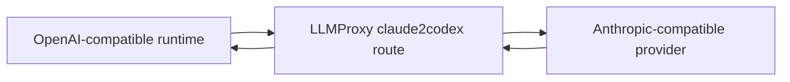

# LLMProxy

LLMProxy is a free protocol bridge for model providers. It is useful when the agent harness expects an OpenAI-style API shape, but the model provider exposes a Claude Code-compatible or Anthropic Messages-compatible API shape.

The hosted Sandbox0 LLMProxy is intentionally simple: no Sandbox0 account, no LLMProxy login, and no gateway configuration step. The upstream provider key is still required, but it should travel through normal request auth or a Sandbox0 LLM vault credential, not through the URL.

## When To Use It

Use LLMProxy when:

- The selected harness is `codex` or another OpenAI-compatible runtime.
- The model provider exposes a Claude Code-compatible or Anthropic Messages-compatible endpoint.
- You only need protocol translation and do not need request logs, caching, budgets, rate limits, or managed BYOK controls from a full AI gateway.
- You want the fastest path: construct the URL, store it as the LLM base URL, and run the agent.

Do not add LLMProxy just because a provider is non-OpenAI. If the selected harness is `claude` and the provider already exposes an Anthropic Messages-compatible endpoint, point the LLM vault directly at that provider. If you need policy, observability, caching, or provider-key management outside Sandbox0, use an AI gateway instead.

## URL Shape

The common Managed Agents path is `claude2codex`, which presents an OpenAI-style surface to the client and forwards to an Anthropic-compatible upstream.

Start with the provider's Anthropic-compatible base URL:

```text
https://api.z.ai/api/anthropic
```

Prefix it with the LLMProxy route:

```text
https://llmproxy.sandbox0.ai/claude2codex/https://api.z.ai/api/anthropic
```

Use that full URL as `sandbox0.managed_agents.llm_base_url` on the LLM vault.

## Codex Example

```typescript
const llmVault = await client.beta.vaults.create({
    display_name: "Codex via LLMProxy",
    metadata: {
        "sandbox0.managed_agents.role": "llm",
        "sandbox0.managed_agents.engine": "codex",
        "sandbox0.managed_agents.llm_base_url": "https://llmproxy.sandbox0.ai/claude2codex/https://api.z.ai/api/anthropic",
    },
});

await client.beta.vaults.credentials.create(llmVault.id, {
    display_name: "Model provider API key",
    auth: {
        type: "static_bearer",
        token: process.env.MODEL_API_KEY!,
    } as any,
});
```

The `MODEL_API_KEY` value is the upstream provider token. The SDK client still authenticates to Sandbox0 Managed Agents with a Sandbox0 API key.

## Request Path



The Managed Agents gateway does not call the model provider directly. It stores the vault credential and passes resolved harness configuration to the runtime. The runtime calls the LLM base URL for the selected harness.

## Operational Notes

- LLMProxy does not require a login, but the upstream model provider usually still requires an API key.
- Do not put API keys, tokens, or customer data in the LLMProxy URL.
- Store provider tokens in LLM vault credentials, not in application config.
- Keep the Sandbox0 Managed Agents API URL separate from the LLM base URL.
- For private deployments, prefer an internal LLMProxy service URL when runtime pods and LLMProxy run in the same cluster.
- LLMProxy is a translation layer, not a session store. Managed Agents session truth and event history remain in Sandbox0.

## Next Steps

<CardGroup>
  <Card title="Agent Harnesses" href="/docs/managed-agents/agent-harnesses" cta="Continue">
    Choose the runtime adapter and model endpoint shape for each managed session.
  </Card>

  <Card title="Compatibility" href="/docs/managed-agents/compatibility" cta="Continue">
    Review supported behavior and current compatibility boundaries.
  </Card>
</CardGroup>
