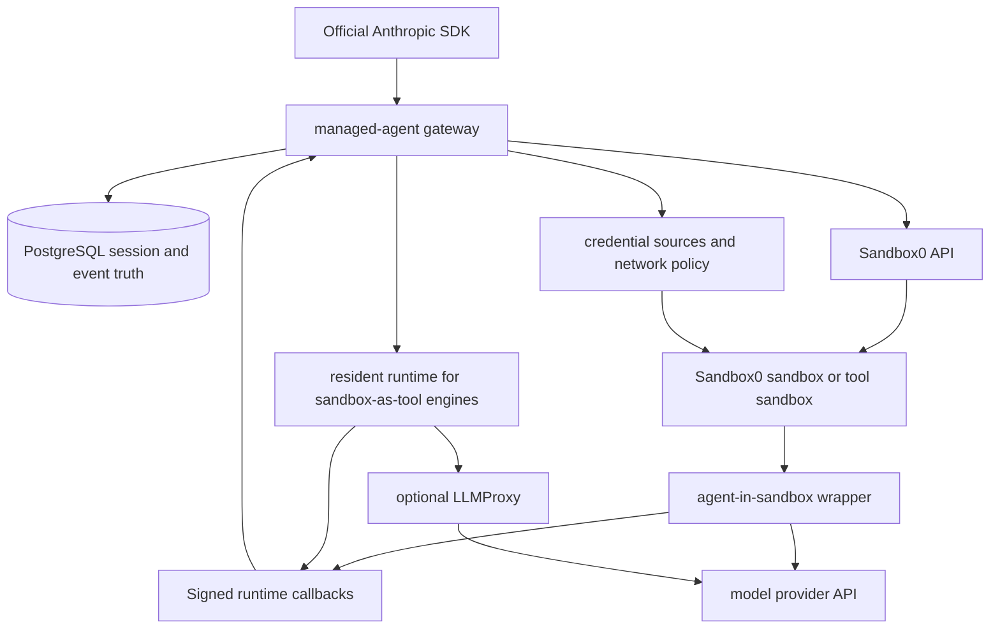

# Managed Agents

Sandbox0 Managed Agents is a backend-compatible implementation of the Claude Managed Agents API shape. Application code uses the official Anthropic SDK, but points the SDK at a Sandbox0 Managed Agents endpoint.

Sandbox0 provides the backend execution layer: durable sessions, event history, sandbox orchestration, persistent workspaces, network policy, and credential injection.

<Callout variant="info">
Use the official Anthropic SDK for client code. The SDK talks to Sandbox0 with a Sandbox0 API key. Model provider credentials belong in vaults, not in the SDK client.
</Callout>

## Core Objects

Managed Agents sit above raw sandboxes. A sandbox gives an agent processes, files, volumes, networking, and webhooks. Managed Agents add a durable API model around those primitives.

| Object | Role |
|--------|------|
| Agent | Versioned instructions, model, tools, MCP servers, and skills |
| Environment | Runtime package and networking configuration |
| Session | Durable unit of work that binds an agent snapshot, environment, resources, and vaults |
| Events | Append-only interaction log for user input, agent output, tools, status, and errors |
| Vault | Credential container attached to a session |
| Resource | File or repository materialized into the session workspace |
| Agent engine | Runtime adapter that runs the session as agent in sandbox or sandbox as tool |
| LLMProxy | Optional protocol translator for model providers with a different API shape |

## Engine Models

Managed Agents can execute in two ways:

| Model | What users should expect | Engines |
|-------|--------------------------|---------|
| Agent in sandbox | The agent runtime process lives inside the per-session sandbox with the workspace and engine state. | `claude`, `codex` |
| Sandbox as tool | A resident runtime service owns the agent loop and uses Sandbox0 as an isolated tool target. | `openai-agents` |

Both models use the same Managed Agents API and durable event stream. Choose the model by selecting an agent engine through the LLM vault.

## Architecture

Session truth lives outside the sandbox. The sandbox is an execution attachment for a session, not the source of truth for session state.

## Request Flow

1. Create an `agent` with a model, system prompt, tools, and optional skills.
2. Create an `environment` with package and network settings.
3. Create an LLM vault with `sandbox0.managed_agents.role = llm` and the target agent engine.
4. Create a session that references the agent, environment, and vault ids.
5. Send `user.message` events.
6. Sandbox0 starts the selected agent engine. Agent-in-sandbox engines claim or resume a sandbox immediately; sandbox-as-tool engines claim a sandbox when a tool needs one.
7. The engine emits callbacks. The gateway appends events to the durable session log.
8. The client lists or streams events until the session becomes idle, requires action, or terminates.

## Sandbox0-Specific Boundaries

The public object model follows Claude Managed Agents where practical. The backend behavior is Sandbox0-specific in these places:

- The API host is Sandbox0, not Anthropic.
- The SDK `apiKey` is a Sandbox0 API key.
- The LLM token is stored in a vault and projected by Sandbox0 credential policy.
- The agent engine is selected through LLM vault metadata.
- `claude` and `codex` run agent in sandbox; `openai-agents` uses sandbox as tool.
- The sandbox workspace is persistent across turns through a Sandbox0 volume.
- Network policy and credential injection are enforced by Sandbox0.

## Official References

The official Claude Managed Agents documentation is still the canonical SDK reference:

- [Quickstart](https://platform.claude.com/docs/en/managed-agents/quickstart)
- [Agent setup](https://platform.claude.com/docs/en/managed-agents/agent-setup)
- [Environments](https://platform.claude.com/docs/en/managed-agents/environments)
- [Sessions](https://platform.claude.com/docs/en/managed-agents/sessions)
- [Vaults](https://platform.claude.com/docs/en/managed-agents/vaults)

## Next Steps

<NextSteps>
  <NextStep title="SDK Usage" href="/docs/managed-agents/sdk">
    Point the official SDK at Sandbox0 and create the first managed session.
  </NextStep>

  <NextStep title="Agents" href="/docs/managed-agents/agents">
    Define versioned agents with prompts, tools, MCP servers, and skills.
  </NextStep>
</NextSteps>
