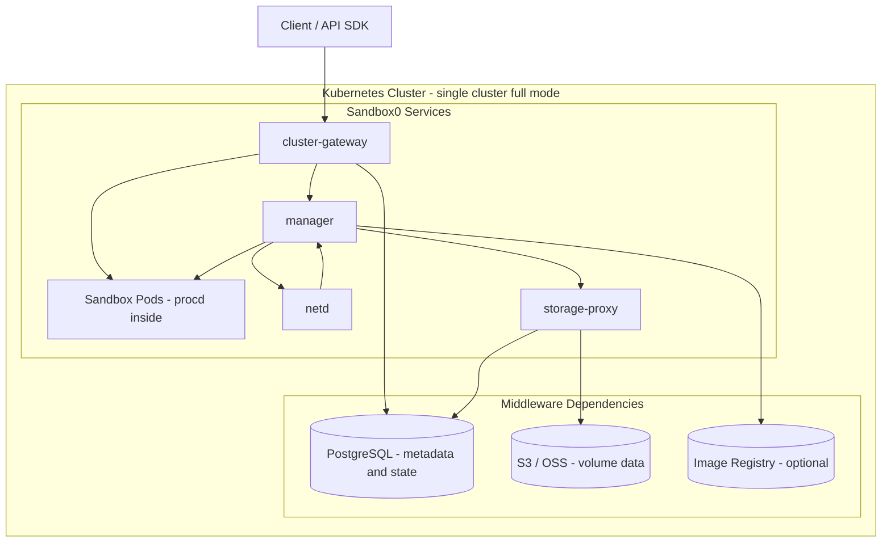

# Self-hosted Overview

This section is intentionally minimal: most teams only need to deploy `infra-operator`, apply one `Sandbox0Infra`, and tune a few fields.

## The One Thing to Know

Sandbox0 self-hosted is **operator-first**.

1. Install `infra-operator`
2. Apply a `Sandbox0Infra` resource
3. Let the operator reconcile services and dependencies

## Architecture

### Planes and Core Services

- **Control plane** (optional in single-cluster): `regional-gateway`, `scheduler`
- **Data plane** (runtime): `cluster-gateway`, `manager`, optional `storage-proxy`, optional `netd`
- **In-pod runtime**: `procd` runs inside each sandbox pod and handles process/files/volume mount operations

### Single-Cluster vs Multi-Cluster

| Mode | Required services | Typical use |
|---|---|---|
| Single-cluster | `cluster-gateway` + `manager` | Most users, fastest path |
| Multi-cluster | control plane (`regional-gateway` + `scheduler`) + one or more data planes | Regional scale-out |

### Full Mode Single-Cluster

In full mode single-cluster, `cluster-gateway`, `manager`, `storage-proxy`, and `netd` are Sandbox0 services. PostgreSQL, S3/OSS, and optional image registry are middleware dependencies.

### Request Flow

- **Single-cluster (typical)**: client -> `cluster-gateway` -> `manager` -> sandbox pod (`procd`)
- **Single-cluster (direct pod path)**: client -> `cluster-gateway` -> sandbox pod (`procd`) (for applicable traffic paths)
- **Multi-cluster**: client -> `regional-gateway` -> `scheduler` -> target cluster `cluster-gateway` -> `manager`

### Regional Boundary

One region should keep control plane and its managed data-plane clusters aligned to the same regional storage context (PostgreSQL + object storage/registry settings).

## What to Configure First

- `spec.database` (builtin for quick start, external for production)
- `spec.storage` (builtin for quick start, S3/OSS for production)
- `spec.registry`
- `spec.services.*.enabled`
- `spec.publicExposure`

## Next Steps

<CardGrid>
  <LinkCard
    title="Install"
    href="/docs/self-hosted/install"
    cta="Start"
  >
    Fastest path to your first running cluster
  </LinkCard>

  <LinkCard
    title="Configuration"
    href="/docs/self-hosted/configuration"
    cta="Configure"
  >
    Only the fields most teams actually need
  </LinkCard>
</CardGrid>
