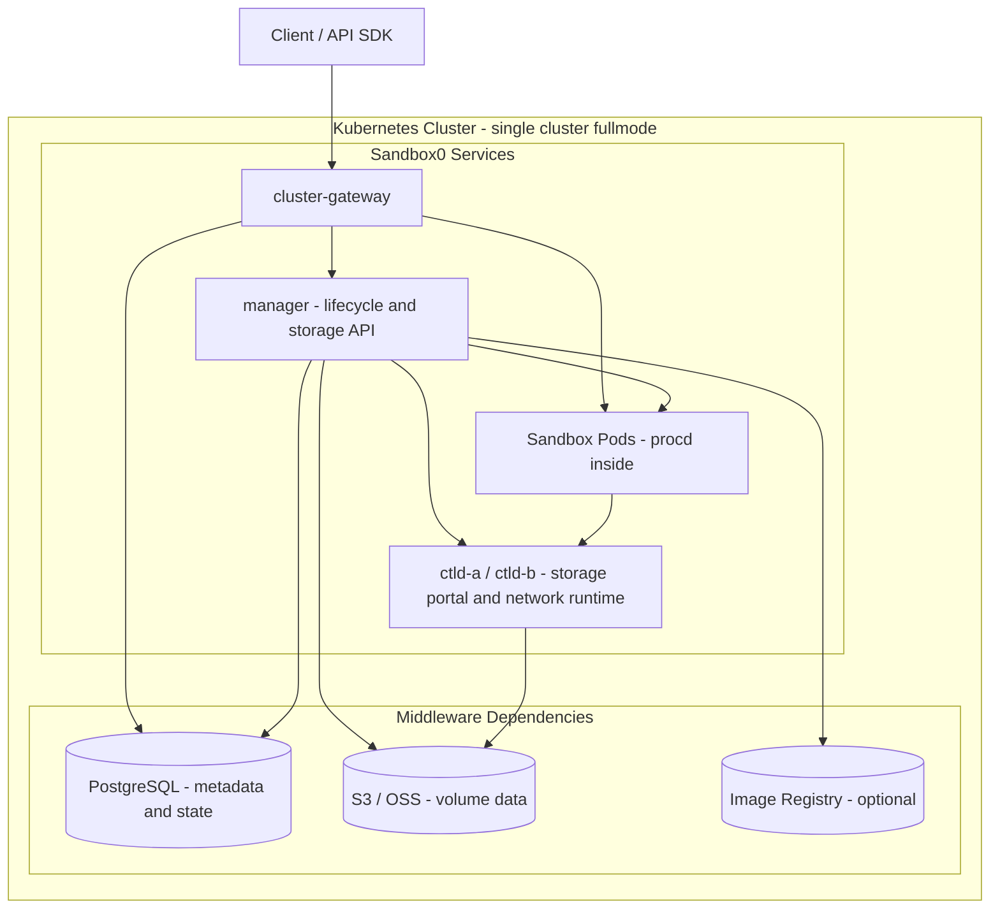

# Self-hosted Overview

This section is intentionally minimal: most teams only need to deploy `infra-operator`, apply one `Sandbox0Infra`, and tune a few fields.

## The One Thing to Know

Sandbox0 self-hosted is **operator-first**.

1. Install `infra-operator`
2. Apply a `Sandbox0Infra` resource
3. Let the operator reconcile services and dependencies

## Architecture

### Planes and Core Services

- **Control plane** (optional in single-cluster): `regional-gateway`, `scheduler`
- **Data plane** (runtime): `cluster-gateway`, `manager` with the storage API runtime, and a node-local `ctld` HA pair for rootfs, volume portals, and network policy
- **In-pod runtime**: `procd` runs inside each sandbox pod and handles process/files/volume mount operations

### Single-Cluster vs Multi-Cluster

| Mode | Required services | Typical use |
|---|---|---|
| Single-cluster | `cluster-gateway` + `manager` + node-local `ctld` HA pair | Most users, fastest path |
| Multi-cluster | control plane (`regional-gateway` + `scheduler`) + one or more data planes | Regional scale-out |

### Fullmode Single-Cluster

In single-cluster fullmode, the storage API runtime runs in the `manager` Deployment. Each sandbox node has `ctld-a` and `ctld-b` DaemonSet Pods; the elected primary owns rootfs persistence, volume portals, and network policy, and the synchronized standby assumes those responsibilities after promotion. PostgreSQL, S3/OSS, and the optional image registry are middleware dependencies.

### Request Flow

- **Single-cluster (typical)**: client -> `cluster-gateway` -> `manager` -> sandbox pod (`procd`)
- **Single-cluster (direct pod path)**: client -> `cluster-gateway` -> sandbox pod (`procd`) (for applicable traffic paths)
- **Volume API**: client -> `cluster-gateway` -> storage runtime in `manager` -> object storage or the active ctld mount owner
- **Sandbox network**: sandbox pod -> network runtime in the active `ctld` process -> allowed upstream
- **Multi-cluster**: client -> `regional-gateway` -> `scheduler` -> target cluster `cluster-gateway` -> `manager`

### Regional Boundary

One region should keep control plane and its managed data-plane clusters aligned to the same regional storage context (PostgreSQL + object storage/registry settings).

## What to Configure First

- `spec.database` (builtin for quick start, external for production)
- `spec.storage` (builtin for quick start, S3/OSS for production)
- `spec.registry`
- `spec.services.clusterGateway` and `spec.services.manager`
- `spec.storage.runtime` and `spec.network`
- `spec.publicExposure`

## Next Steps

<CardGroup>
  <Card title="Install" href="/docs/sandbox/self-hosted/install" cta="Continue">
    Install the operator and create the first self-hosted environment.
  </Card>

  <Card title="Configuration" href="/docs/sandbox/self-hosted/configuration" cta="Continue">
    Tune topology, storage, networking, and service-level configuration.
  </Card>
</CardGroup>
