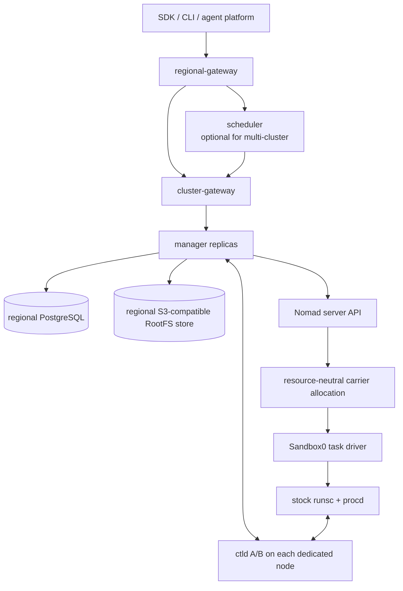

# Self-hosted Overview

Sandbox0 self-hosting uses dedicated Nomad client nodes, stock gVisor `runsc`,
direct node services, regional PostgreSQL, and S3-compatible RootFS storage.

## Architecture

```mermaid
flowchart TB
    client["SDK / CLI / agent platform"] --> regional["regional-gateway"]
    regional --> scheduler["scheduler<br/>optional for multi-cluster"]
    regional --> cluster["cluster-gateway"]
    scheduler --> cluster
    cluster --> manager["manager replicas"]
    manager --> pg[("regional PostgreSQL")]
    manager --> s3[("regional S3-compatible RootFS store")]
    manager --> nomad["Nomad server API"]
    manager <--> ctld["ctld A/B on each dedicated node"]
    nomad --> carrier["resource-neutral carrier allocation"]
    carrier --> driver["Sandbox0 task driver"]
    driver --> runsc["stock runsc + procd"]
    runsc <--> ctld
```

## Service Boundaries

| Scope | Components | Responsibility |
| --- | --- | --- |
| Global, optional | `global-gateway` | Team-to-region directory and global identity entrypoint. It does not understand cluster topology. |
| Region control | `regional-gateway`, optional `scheduler`, `ssh-gateway` | External API, identity, internal routing, and multi-cluster selection. |
| Data-plane control | `cluster-gateway`, active-active `manager` | Sandbox/template APIs, lifecycle truth, RootFS metadata, node capacity, and claim transactions. |
| Dedicated Nomad node | Nomad client, `ctld-a`, `ctld-b`, `nomad-driver-sandbox0`, stock `runsc` | Resource leases, cgroups, RootFS mounts, network policy, runtime creation, and terminal proof. |
| Sandbox | `procd` inside gVisor | Commands, contexts, files, services, and events. |
| Regional storage | PostgreSQL, S3-compatible object storage, optional ClickHouse | Transactional truth, encrypted RootFS blocks, and asynchronous metering/observability read models. |

A region may have several data-plane clusters. They share that region's
PostgreSQL and S3 authorities. `scheduler` selects a cluster from live
PostgreSQL capacity for new claims; existing sandbox requests route to the
sandbox's recorded cluster.

For a single-cluster installation, `cluster-gateway` can run in full mode and
act as the external regional entrypoint. `scheduler` is optional in that
topology.

## Unified Resource Pool

Nomad schedules dedicated Sandbox0 nodes and resource-neutral warm carrier
allocations. Carrier CPU and memory reserve only allocation overhead. Manager
and PostgreSQL atomically lease exact sandbox CPU and memory from
ctld-advertised node capacity.

Compatibility classes contain only immutable runtime properties. CPU quota,
CPU weight, cpuset, memory, and PIDs are dynamic claim properties and do not
split the pool. Production nodes must be dedicated to Sandbox0 so Nomad cannot
allocate the same physical capacity to unrelated jobs.

## RootFS Boundary

Manager owns regional RootFS metadata and the durable OCI importer. `ctld` owns
node-local block attachment and the exact active writer. Writable generations,
snapshots, forks, template captures, and rebase operations are block-COW state
stored in S3-compatible storage.

A terminal resource lease is released only after a plugin-independent
reconciler proves the old writer, runsc process, mount, network state, and
cgroup absent. Driver disappearance alone is never terminal proof.

## Metering Boundary

Open-source Sandbox0 owns usage truth. PostgreSQL's `metering` schema stores
projection state and transactional `projection_outbox`. ClickHouse is an
asynchronous query projection for history, quota aggregates, and export. The
normal direction is PostgreSQL to ClickHouse; the two stores are not separate
usage authorities.

Pricing, invoices, payments, and billing remain outside this repository.

## Deployment Assets

- [`deploy/nomad/control`](https://github.com/sandbox0-ai/sandbox0/tree/main/deploy/nomad/control): direct systemd boundary for gateways, manager, scheduler, and SSH gateway.
- [`deploy/nomad/ctld`](https://github.com/sandbox0-ai/sandbox0/tree/main/deploy/nomad/ctld): node installer, ctld A/B units, cgroup setup, NBD configuration, and Nomad plugin configuration.
- [`nomad-driver-sandbox0/example`](https://github.com/sandbox0-ai/sandbox0/tree/main/nomad-driver-sandbox0/example): runtime-class catalog, trusted Nomad endpoint catalog, and warm-carrier job.

## Next Steps

<CardGroup>
  <Card title="Install" href="/docs/self-hosted/install" cta="Continue">
    Provision stores, control services, and dedicated Nomad nodes.
  </Card>
  <Card title="Configuration" href="/docs/self-hosted/configuration" cta="Configure">
    Pin runtime identity, capacity, credentials, and safety controls.
  </Card>
  <Card title="Observability" href="/docs/self-hosted/observability" cta="Observe">
    Export platform telemetry and build query projections.
  </Card>
</CardGroup>
