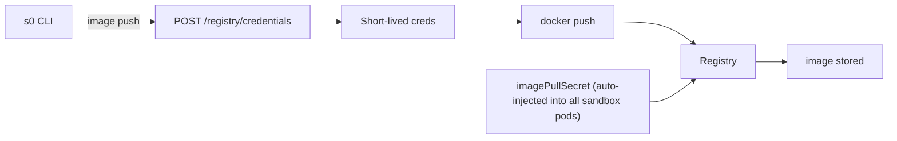

# Custom Images

Every Template references a container image. Sandbox0 supports two types of images:

| Type | Description | Example |
|------|-------------|---------|
| **Public image** | Any image from a public registry | `python:3.12-slim`, `node:20-alpine` |
| **Private image** | Your own image pushed to the Sandbox0 registry | `registry.sandbox0-system.svc.cluster.local:5000/t-<team-key>/my-app:v1.2.3` |

For private images, Sandbox0 provides a built-in registry and a CLI workflow to build and push images securely. Authentication is handled automatically — your images are protected and only accessible to your team. You can also [create a template from an existing sandbox](/docs/sandbox/template#create-template-from-a-sandbox); Sandbox0 captures the root filesystem and publishes the resulting private image without requiring a local Docker daemon.

<Callout variant="info">
If a template will run [Sandbox Functions](/docs/sandbox/functions), its image must include `python3` in `PATH` and use Python 3.9 or later. Sandbox0 injects the function runner, but the runner executes the Python interpreter from the template image, not from the manager image.
</Callout>

---

## Using a Public Image

To use a public image, simply reference it in your template's `mainContainer.image` field:

```yaml
spec:
    mainContainer:
        image: python:3.12-slim
        resources:
            memory: 2Gi
    pool:
        minIdle: 2
        maxIdle: 10
```

---

## Using a Private Image

When you already have a Dockerfile or another reproducible image build, private images use a two-step workflow with the `s0` CLI:

<Callout variant="info">
If the desired environment already exists inside a sandbox, use `s0 template create --from-sandbox` instead. The server publishes to the configured team registry and records a digest-pinned image automatically, so you do not run `image build`, `image push`, or choose a repository.
</Callout>

### Step 1 — Build Your Image

Build a container image from a Dockerfile using your local Docker daemon. You can use either method:

```bash
# Option 1: Using s0 CLI (recommended for convenience)
s0 template image build . -t my-app:v1.2.3

# Option 2: Using docker build directly
docker build . -t my-app:v1.2.3
```

Both commands are equivalent — `s0 template image build` is a thin wrapper around `docker build`.

**Build options:**

| Flag | Description |
|------|-------------|
| `-t, --tag` | Image name and tag (required) |
| `-f, --file` | Path to Dockerfile (default: `Dockerfile`) |
| `--platform` | Target platform (e.g., `linux/amd64`) |
| `--no-cache` | Disable build cache |
| `--pull` | Always pull a newer base image |

```bash
# Build with a custom Dockerfile
s0 template image build . -t my-app:v1.2.3 -f docker/Dockerfile.prod

# Build for a specific platform
s0 template image build . -t my-app:v1.2.3 --platform linux/amd64

# Full rebuild without cache
s0 template image build . -t my-app:v1.2.3 --no-cache
```

<Callout variant="info">
Both methods use your local Docker daemon to build the image. Make sure Docker is running before executing these commands.
</Callout>

### Step 2 — Push to the Sandbox0 Registry

Push the locally built image to the Sandbox0 registry. The CLI automatically retrieves short-lived credentials from the API and scopes the push to your team prefix:

```bash
s0 template image push my-app:v1.2.3 -t my-app:v1.2.3
```

| Flag | Description |
|------|-------------|
| `-t, --tag` | Target image name and tag in the Sandbox0 registry (required) |

The push command:
1. Calls `POST /api/v1/registry/credentials` to obtain short-lived credentials
2. Re-tags the local image with the registry hostname prepended
3. Pushes the image using your Docker daemon

<Callout variant="info">
Credentials are short-lived and fetched automatically each time you push. You do not need to run `docker login` manually.
</Callout>

### Step 3 — Reference the Pull Image in Your Template

After `s0 template image push`, use the `Template image reference` value in your template spec.
This reference is the in-cluster pull address and may differ from the external push address.

```bash
$ s0 template image push my-app:v1.2.3 -t my-app:v1.2.3
...
Image pushed successfully: 127.0.0.1:30500/t-<team-key>/my-app:v1.2.3
Template image reference: registry.sandbox0-system.svc.cluster.local:5000/t-<team-key>/my-app:v1.2.3
```

Use that `Template image reference` value:

```yaml
spec:
    mainContainer:
        image: registry.sandbox0-system.svc.cluster.local:5000/t-<team-key>/my-app:v1.2.3
        resources:
            memory: 8Gi
    pool:
        minIdle: 2
        maxIdle: 10
```

Then create or update the template:

```bash
s0 template create --id my-app --spec-file template.yaml
# or update an existing template:
s0 template update my-app --spec-file template.yaml
```

---

## Full Workflow Example

```bash
# 1. Build the image (either method works)
s0 template image build . -t my-app:v1.2.3
# or: docker build . -t my-app:v1.2.3

# 2. Push to Sandbox0 registry
s0 template image push my-app:v1.2.3 -t my-app:v1.2.3

# 3. Create the template using "Template image reference"
cat > template.yaml << 'EOF'
spec:
    mainContainer:
        image: registry.sandbox0-system.svc.cluster.local:5000/t-<team-key>/my-app:v1.2.3
        resources:
            memory: 8Gi
    pool:
        minIdle: 2
        maxIdle: 10
EOF

s0 template create --id my-app --spec-file template.yaml

# 4. Create a sandbox from your template
s0 sandbox create --template my-app
```

---

## Registry Providers (beta)

Sandbox0 supports multiple container registry backends. The registry provider is configured by the platform operator:

| Provider | Backend | Notes |
|----------|---------|-------|
| `builtin` | Self-hosted Docker Registry v2 | Default. Deployed and managed within the cluster. |
| `aws` | Amazon ECR | Short-lived tokens (12h). Can optionally use `AssumeRole` + session policy for team-scoped pushes. |
| `gcp` | Google Artifact Registry / GCR | Uses service account credentials. |
| `azure` | Azure Container Registry | Uses ACR credentials. |
| `aliyun` | Alibaba Cloud Container Registry | Uses Aliyun ACR credentials. |
| `harbor` | Harbor | Uses Harbor robot/user credentials from Kubernetes Secret. |

For all providers, the `s0 template image push` command handles credential retrieval transparently — you always use the same CLI command regardless of the backend.

---

## How Authentication Works

Sandbox0 handles image pull authentication at the cluster level — you do not need to configure credentials in each template.



The platform operator maintains a cluster-wide `imagePullSecret` that is automatically injected into every sandbox pod. As a template author, you only need to reference the correct image name — no credential configuration is required in the template spec.

<Callout variant="info">
For self-hosted deployments, the `builtin` registry provider automatically provisions and manages the pull secret. For external registries (ECR, GCP, ACR, Aliyun, Harbor), the platform operator pre-configures the credentials once during cluster setup.
</Callout>

---

## Next Steps

<CardGroup>
  <Card title="Warm Pool" href="/docs/sandbox/template/pool" cta="Continue">
    Use warm pools to reduce startup latency for common templates.
  </Card>
</CardGroup>
