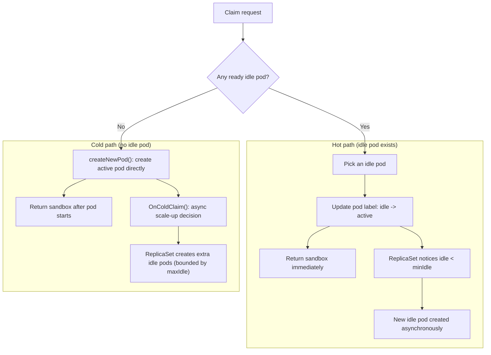

# Warm Pool

Sandbox0 achieves sub-200ms sandbox creation by maintaining a pool of pre-warmed idle pods for each template. When you claim a sandbox, an idle pod is immediately assigned instead of waiting for a cold container start.

## How the Pool Works



When a sandbox is claimed:
1. The manager first tries to claim a ready idle pod (`claimIdlePod`)
2. If successful (hot claim), the pod is relabeled to `active` and returned immediately; pool replenishment happens asynchronously via ReplicaSet reconcile
3. If no idle pod exists (cold claim), the manager directly creates a new active pod (`createNewPod`) and asynchronously triggers scale-up (`OnColdClaim`) to rebuild idle capacity

As long as `minIdle` idle pods are available, every claim is a **zero-cold-start** operation.

In practice, “available” means the pod is ready for claiming, not merely `Pod Running`.
Template-declared Volume portals are pre-mounted in idle pods. A claim can bind any subset of those paths to Sandbox Volumes without bypassing the warm pool; declared paths omitted from the claim remain writable rootfs-backed directories and are captured by rootfs checkpoints.

---

## Pool Fields

Configure the pool strategy in your template spec under the `pool` key:

| Field | Type | Description |
|-------|------|-------------|
| `minIdle` | integer | Minimum number of idle pods to maintain (ReplicaSet replicas). Claims always succeed instantly while idle pods are available. |
| `maxIdle` | integer | Maximum number of idle pods allowed for autoscaling decisions. The autoscaler caps scale-up at this value, and template status reports `PoolHealthy=False` if idle pods exceed it. |

```yaml
spec:
    pool:
        minIdle: 3
        maxIdle: 10
```

---

## minIdle — Guaranteed Fast Starts

`minIdle` is the number of idle pods the system keeps running at all times. The manager's ReplicaSet controller continuously reconciles towards this count:

- If idle pods drop below `minIdle` (due to claims), new pods start immediately
- If the node has capacity, `minIdle` pods are pre-warmed and ready before any request arrives

## Readiness Gates Pool Capacity

Warm-pool capacity is counted from idle pods that are ready for claiming.

- An idle pod in `Running` phase but with `Ready=False` does not count toward `idleCount`
- A hot claim only selects idle pods that are already `Ready`
- Readiness is based on the sandbox container, procd, and volume portal state

**Choosing `minIdle`:**

| Workload Pattern | Recommended `minIdle` |
|------------------|-----------------------|
| Low traffic / dev environments | 1–2 |
| Steady interactive traffic | 3–5 |
| Burst-heavy production | 5–20+ |
| Single-user tool | 1 |

<Callout variant="warning">
Idle pods use a fixed low CPU and memory allocation while they wait in the warm pool. `mainContainer.resources` remains the default sandbox resource contract; Sandbox0 requests a hot-claimed idle pod resize to the template or claim-time resources during claim. Setting `minIdle` too high still consumes cluster capacity, image cache, ephemeral-storage headroom, and runtime overhead. Monitor your claim rate and set `minIdle` to match your typical concurrency.
</Callout>

---

## maxIdle — Capping Idle Resources

`maxIdle` puts an upper bound on idle pool size for autoscaling decisions. The autoscaler uses it as a hard cap when deciding target replicas:

- Prevents scale-up from growing beyond a configured ceiling
- Works with template status conditions (`PoolHealthy=False`) to signal idle over-provisioning

A common pattern: set `maxIdle` to 2–3x `minIdle` to absorb burst traffic while keeping costs bounded.

```yaml
pool:
    minIdle: 3
    maxIdle: 9   # burst headroom = 3x minIdle
```

---

## Pool and Template Updates

When you update a template spec, the warm pool is recycled:

1. Existing idle pods (running the old spec) are drained
2. New idle pods are created with the updated spec
3. Running sandboxes are **not** affected

During the transition, the pool may temporarily drop below `minIdle`. Plan updates during low-traffic windows if uninterrupted pool availability is critical.

---

## Next Steps

<CardGroup>
  <Card title="Configuration" href="/docs/sandbox/template/configuration" cta="Continue">
    Tune template resources, runtime behavior, mounts, and networking.
  </Card>
</CardGroup>
