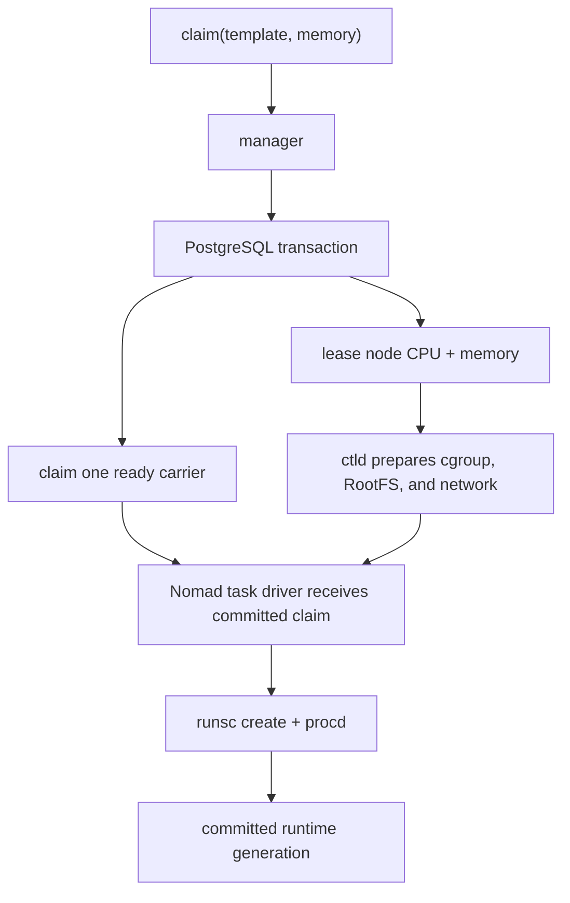

# Unified Warm Pool

Sandbox0 uses one resource-neutral pool of pre-created Nomad carrier
allocations per immutable runtime compatibility class. A template does not own
or size a separate pool.

<Callout variant="warning">
Platform administrators size the shared carrier pool with the Nomad warm-slot
job. Templates do not own carrier counts or separate resource pools.
</Callout>

## Claim Path

```mermaid
flowchart TB
    request["claim(template, memory)"] --> manager["manager"]
    manager --> tx["PostgreSQL transaction"]
    tx --> capacity["lease node CPU + memory"]
    tx --> slot["claim one ready carrier"]
    capacity --> ctld["ctld prepares cgroup, RootFS, and network"]
    slot --> driver["Nomad task driver receives committed claim"]
    ctld --> driver
    driver --> runsc["runsc create + procd"]
    runsc --> ready["committed runtime generation"]
```

A claim performs these steps:

1. Manager resolves the template's digest-pinned image or block-COW RootFS
   source and derives CPU from the requested memory.
2. PostgreSQL atomically reserves exact node capacity, one ready carrier, and a
   resource lease. Competing claims cannot spend the same capacity or slot.
3. `ctld` creates the lease cgroup, attaches RootFS, and applies the sandbox
   network policy.
4. The task driver writes the committed CPU, cpuset, memory, and PIDs limits
   into the OCI spec and starts stock `runsc`.
5. The runtime is exposed only after manager commits the new runtime generation.

Nomad carrier `resources` reserve only driver and allocation overhead. They are
never copied into the sandbox OCI limits and are not metering truth.

## Compatibility Classes

A warm carrier can serve any template whose immutable runtime requirements
match the carrier class. Class inputs include:

- CPU architecture and RootFS artifact platform;
- task-driver and stock `runsc` versions;
- gVisor platform;
- overlay, file-access, and DirectFS modes;
- RootFS format generation; and
- security class or required special devices.

CPU quota, CPU weight, cpuset, memory, and PIDs are dynamic lease properties.
They must not appear in the compatibility digest. This is what allows a 512 MiB
claim and an 8 GiB claim to draw from the same warm pool when their immutable
runtime class is otherwise identical.

Until the public API exposes an explicit class selector, configure exactly one
compatible class for each requested cluster. Zero or multiple matches fail
closed instead of selecting an ambiguous runtime.

## Capacity And Replenishment

The platform administrator controls the number of carriers with the `count` in
`nomad-driver-sandbox0/example/warm-slot.nomad`. A carrier is single-use:
a terminal sandbox consumes its allocation, and Nomad creates a fresh
allocation with a fresh network namespace. Task restart in the old allocation
is disabled.

A ready carrier alone is insufficient. A claim also requires all of the
following:

- live, non-expired ctld-reported node capacity;
- enough free CPU and memory in the dedicated node cpuset;
- a connected and attested node channel;
- an available RootFS/NBD attachment; and
- a matching immutable runtime class.

If any requirement is missing, the claim fails closed as unavailable. Increase
carrier count, dedicated node capacity, and the configured NBD pool together;
adding carriers cannot create CPU, memory, or devices.

Production Sandbox0 Nomad clients must belong to the dedicated `sandbox0` node
pool and advertise `sandbox0_dedicated=true`. Do not place general Nomad jobs on
those nodes, because Sandbox0's PostgreSQL resource leases—not Nomad allocation
resources—are the node's sandbox capacity authority.

## Release Safety

Capacity is not returned when an API request merely asks a sandbox to stop.
The plugin-independent regional terminal reconciler releases the lease only
after it proves that the old writer, `runsc` instance, RootFS mount, network
state, and lease cgroup are gone. The same rule applies after driver crashes,
ctld A/B failover, manager restarts, and authenticated node reboots.

This delayed release prevents a stale runtime from overlapping a new claim on
the same CPU, memory, writer, mount, or network identity.

## Sizing And Validation

Monitor ready carriers, free resource leases, NBD availability, claim latency,
and replacement lag. Size for synchronized bursts rather than average request
rate.

The production acceptance gate requires at least eight ready carriers, eight
truthful dedicated CPU cores, enough non-oversubscribed memory, serial and
synchronized-concurrency runs, multi-node failure injection, and security
checks. A smaller local machine can validate only its real width and must not be
reported as an eight-way result.

## Next Steps

<CardGroup>
  <Card title="Self-hosted configuration" href="/docs/self-hosted/configuration" cta="Continue">
    Configure runtime classes, node capacity, and carrier jobs.
  </Card>
</CardGroup>
