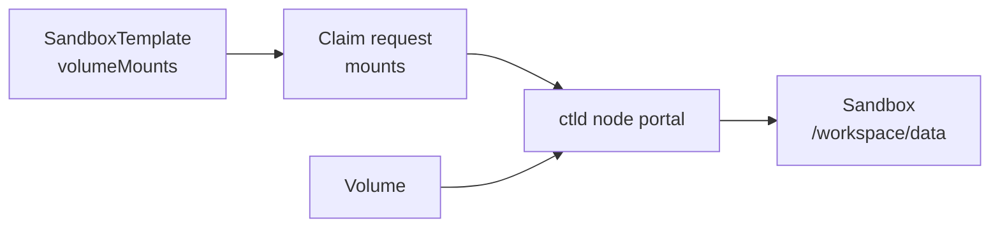

# Volume Mounts

Volumes are mounted through template-declared mount points and bound when a Sandbox is claimed.

Dynamic mount and unmount APIs are no longer part of the Sandbox API. Define the allowed mount paths in the template, then provide the Volume IDs for those paths in the claim request.

## Mount Flow



## Define Mount Points

Template mount paths are fixed before the Sandbox starts.

```yaml
apiVersion: sandbox0.ai/v1alpha1
kind: SandboxTemplate
metadata:
  name: default
spec:
  volumeMounts:
    - name: workspace-data
      mountPath: /workspace/data
      readOnly: false
```

Mount path requirements:

- `name` must be unique within the template.
- `mountPath` must be an absolute, clean path.
- `/` is not allowed.
- Paths under `/var/lib/sandbox0/procd` are reserved for Sandbox0 internals.

## Claim With a Volume

The claim request binds existing Volumes to template-declared paths.

```json
{
    "template": "default",
    "mounts": [
        {
            "sandboxvolume_id": "vol_123",
            "mount_point": "/workspace/data"
        }
    ]
}
```

`mount_point` must match a path declared in `spec.volumeMounts`.

## Access Modes

`RWO` is the high-performance read-write mount mode. Sandbox0 binds the volume to a node-local ctld portal and uses a local write-ahead log before materializing data to object storage.

`ROX` can be mounted only on template paths marked `readOnly: true`.

`RWX` is not accepted for Sandbox mounts in this node-local implementation. Use direct file APIs for control-plane file operations, or use separate `RWO` volumes for write-heavy Sandbox workloads.

## File Operations

After claim completes, use the mounted path like a normal filesystem:

```bash
echo "hello" >/workspace/data/hello.txt
cat /workspace/data/hello.txt
```

For control-plane file operations without a Sandbox, use `/api/v1/sandboxvolumes/{'{id}'}/files`.
