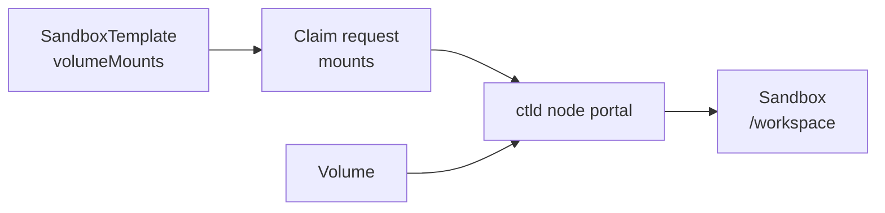

# Volume Mounts

Volumes are mounted through template-declared mount points and bound when a Sandbox is claimed.

Dynamic mount and unmount APIs are no longer part of the Sandbox API. Define the allowed mount paths in the template, then provide the Volume IDs for those paths in the claim request.

## Mount Flow



## Define Mount Points

Template mount paths are fixed before the Sandbox starts.

```yaml
apiVersion: sandbox0.ai/v1alpha1
kind: SandboxTemplate
metadata:
    name: default
spec:
    volumeMounts:
        - name: workspace
          mountPath: /workspace
          readOnly: false
```

The operator-managed `default` builtin template already declares the writable `/workspace` mount point. Custom templates must declare each mount point explicitly.

Mount path requirements:

- `name` must be unique within the template.
- `mountPath` must be an absolute, clean path.
- `/` is not allowed.
- Paths under `/var/lib/sandbox0/procd` are reserved for Sandbox0 internals.

## Claim With a Volume

The claim request binds existing Volumes to template-declared paths.

<Endpoint method="POST">
/api/v1/sandboxes
</Endpoint>

<Tabs
  tabs={[
    {
      label: "Go",
      language: "go",
      code: `sandbox, err := client.ClaimSandbox(
    ctx,
    "default",
    sandbox0.WithSandboxBootstrapMount(volume.ID, "/workspace"),
)
if err != nil {
    log.Fatal(err)
}
for _, mount := range sandbox.BootstrapMounts {
    fmt.Printf("%s %s\\n", mount.SandboxvolumeID, mount.State)
}`
    },
    {
      label: "Python",
      language: "python",
      code: `from sandbox0.apispec.models.claim_mount_request import ClaimMountRequest

sandbox = client.sandboxes.claim(
    "default",
    mounts=[
        ClaimMountRequest(
            sandboxvolume_id=volume.id,
            mount_point="/workspace",
        )
    ],
)
for mount in sandbox.bootstrap_mounts:
    print(mount.sandboxvolume_id, mount.state)`
    },
    {
      label: "TypeScript",
      language: "typescript",
      code: `const sandbox = await client.sandboxes.claim("default", {
    mounts: [{ sandboxvolumeId: volume.id, mountPoint: "/workspace" }],
});
for (const mount of sandbox.bootstrapMounts) {
    console.log(mount.sandboxvolumeId, mount.state);
}`
    },
    {
      label: "CLI",
      language: "bash",
      code: `VOLUME_ID="vol_123"
s0 sandbox create \\
    --template default \\
    --mount "$VOLUME_ID:/workspace" \\
    -o json`
    }
  ]}
/>

`mount_point` must match a path declared in `spec.volumeMounts`. A claim may bind any subset of the declared mount paths.

Only mounts present in the claim request are treated as bound Sandbox Volume paths for that Sandbox. Bound Sandbox Volume paths are excluded from rootfs pause, snapshot, restore, and fork checkpoints because their contents are owned by the Sandbox Volume. Declared paths omitted from the claim are created as writable rootfs directories, so their contents are captured by rootfs pause, snapshot, restore, and fork checkpoints.

## Access Modes

`RWO` is the high-performance read-write mount mode. Sandbox0 binds the volume to a node-local ctld portal and uses a local write-ahead log before materializing data to object storage.

`ROX` can be mounted only on template paths marked `readOnly: true`.

`RWX` is not accepted for Sandbox mounts in this node-local implementation. Use direct file APIs for control-plane file operations, or use separate `RWO` volumes for write-heavy Sandbox workloads.

## S3 Backend Mounts

Volumes created with `backend: "s3"` are mounted through the same template-declared volume portal. The mounted path exposes the configured S3-compatible prefix as a filesystem: keys use `/` as directory separators, common prefixes appear as directories, and files created inside the Sandbox are uploaded as S3 objects when the file handle is closed or flushed.

The S3 backend supports `RWO` and `ROX` mounts. Writable opens replace the target object and must write sequentially; random in-place overwrites are not supported. It does not support `RWX`, snapshots, restore, forks, renames, hard links, symlinks, xattrs, file locks, or fallocate. Use it when the desired source of truth is an existing S3/OSS/R2 prefix rather than a Sandbox0-managed `s0fs` volume.

For create-time fields and provider-specific configuration, see [Volume Backends](./backends).

## Correctness Guarantees

Mounted `RWO` volumes use one active writable owner at a time.

- the mounted sandbox path is the authoritative writer
- direct volume file API requests are routed to that mounted owner while the mount is active
- Sandbox0 avoids opening a second writable direct mount for the same mounted `RWO` volume

This is what keeps file changes visible both from inside the sandbox and through the volume file API.

## File Operations

After claim completes, use the mounted path like a normal filesystem:

```bash
echo "hello" >/workspace/hello.txt
cat /workspace/hello.txt
```

For control-plane file operations without a Sandbox, use `/api/v1/sandboxvolumes/{'{id}'}/files`.

## Next Steps

<CardGroup>
  <Card title="HTTP" href="/docs/sandbox/volume/http" cta="Continue">
    Use direct volume file APIs outside a running sandbox mount.
  </Card>

  <Card title="Snapshots" href="/docs/sandbox/volume/snapshots" cta="Continue">
    Create and restore point-in-time volume snapshots.
  </Card>
</CardGroup>
