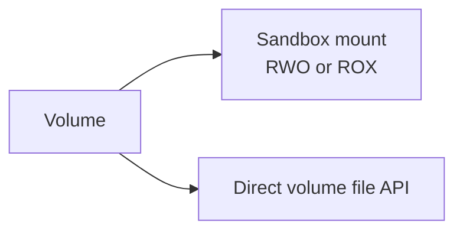

# Volume

Volume provides persistent storage for Sandbox0. It is a storage unit independent of the Sandbox lifecycle, allowing data sharing and reuse across multiple Sandboxes.

## Why Volumes?

The default Sandbox filesystem is ephemeral—when a Sandbox is deleted, all its data is lost. Volumes solve this problem:

- **Data Persistence**: Store data that needs long-term retention, such as databases, model files, and user uploads
- **Cross-Sandbox Sharing**: Mount the same Volume to multiple Sandboxes for data sharing
- **Fast Snapshots**: Create point-in-time snapshots in seconds for backup and versioning
- **Fast Forking**: Create independent child Volumes with Copy-on-Write isolation
- **Quick Recovery**: Restore from snapshots quickly, ideal for rollbacks and environment cloning

## Volume and Sandbox Relationship

## Access Modes

Volumes support three access modes:

| Mode | Full Name | Description | Typical Use Cases |
|------|-----------|-------------|-------------------|
| `RWO` | Read-Write Once | One writable owner at a time | Agent workspaces, databases, exclusive write-heavy state |
| `ROX` | Read-Only Cross | Multi-sandbox read-only distribution | Shared model files, static assets, reference datasets |
| `RWX` | Read-Write Cross | Shared read-write volume mode for direct API workflows | Control-plane style file workflows and shared storage patterns that do not rely on sandbox mounts |

<Callout variant="info">
The default access mode is `RWO`. Sandbox mounts are declared by the template and bound at claim time. `RWO` mounts use node-local write-ahead logging for low-latency small-file workloads, `ROX` is for read-only sharing, and `RWX` is not accepted for sandbox mounts in the current node-local mount path.
</Callout>

## Correctness Model

For mounted `RWO` volumes, Sandbox0 keeps one active writable owner at a time.

- when a sandbox mounts an `RWO` volume, the node-local mount owner becomes authoritative for reads and writes
- direct volume file API requests are routed to that mounted owner instead of opening a second writable mount
- when the volume is not mounted into a sandbox, `storage-proxy` serves direct file API requests itself

This keeps the mounted filesystem view and the direct volume API view consistent in both directions.

## Application-Layer Encryption

Self-hosted deployments can enable Sandbox0 application-layer volume encryption with `services.storageProxy.config.objectEncryptionEnabled`.

When enabled, S0FS encrypts persisted volume objects before they are written to object storage. Manifest objects are encrypted as full blobs. Segment objects are encrypted in independently authenticated chunks, so cold file reads can still fetch only the ciphertext chunks needed for the requested byte range. Node-local cache files, including the S0FS WAL, head state, and snapshot state, are also encrypted before they are written to disk.

<Callout variant="info">
Object encryption is service-side application-layer encryption. `storage-proxy` and `ctld` hold the configured key so they can serve normal POSIX filesystem reads and writes. This is not end-to-end encryption where Sandbox0 services cannot decrypt volume data.
</Callout>

## Direct File Operations

You can operate on files in a Volume directly by volume ID, without mounting the Volume into a Sandbox first.

This is useful for SDK workflows, developer tooling, and small control-plane style file tasks where starting or reusing a Sandbox would only add latency.

<Callout variant="info">
Direct volume file APIs still go through the normal gateway chain and team-scoped auth. When a volume is already mounted into a sandbox, the API request is served by that mounted owner. When it is not mounted, `storage-proxy` lazily attaches the volume on demand and reclaims idle direct mounts later.
</Callout>

The direct file API surface mirrors the Sandbox file API:

| Operation | Endpoint |
|-----------|----------|
| Read / Write / Delete | `GET`, `POST`, `DELETE /api/v1/sandboxvolumes/{'{id}'}/files?path=...` |
| Stat | `GET /api/v1/sandboxvolumes/{'{id}'}/files/stat?path=...` |
| List directory | `GET /api/v1/sandboxvolumes/{'{id}'}/files/list?path=...` |
| Move / Rename | `POST /api/v1/sandboxvolumes/{'{id}'}/files/move` |
| Watch | `GET /api/v1/sandboxvolumes/{'{id}'}/files/watch` |

Paths are always resolved relative to the root of the Volume namespace.

For SDK, CLI, and direct HTTP file workflows, see the dedicated [Volume HTTP](./http) page.

---

## Create Volume

Create a new persistent volume with an access mode.

<Endpoint method="POST">
/api/v1/sandboxvolumes
</Endpoint>

<Tabs
  tabs={[
    {
      label: "Go",
      language: "go",
      code: `volume, err := client.CreateVolume(ctx, apispec.CreateSandboxVolumeRequest{
    AccessMode: apispec.NewOptVolumeAccessMode(apispec.VolumeAccessModeRWO),
})
if err != nil {
    log.Fatal(err)
}
fmt.Printf("Volume ID: %s\\n", volume.ID)`
    },
    {
      label: "Python",
      language: "python",
      code: `from sandbox0.apispec.models.create_sandbox_volume_request import CreateSandboxVolumeRequest
from sandbox0.apispec.models.volume_access_mode import VolumeAccessMode
    
volume = client.volumes.create(CreateSandboxVolumeRequest(
    access_mode=VolumeAccessMode.RWO,
))
print(f"Volume ID: {volume.id}")`
    },
    {
      label: "TypeScript",
      language: "typescript",
      code: `import { models } from "sandbox0";

const volume = await client.volumes.create({
    accessMode: models.VolumeAccessMode.Rwo,
});
console.log("Volume ID:", volume.id);`
    },
    {
      label: "CLI",
      language: "bash",
      code: `# Create a volume
s0 volume create --access-mode RWO

# For automation, prefer machine-readable output
s0 volume create --access-mode RWO -o json`
    }
  ]}
/>

---

## Get Volume Details

Retrieve a specific volume by ID.

<Endpoint method="GET">
/api/v1/sandboxvolumes/{'{id}'}
</Endpoint>

<Tabs
  tabs={[
    {
      label: "Go",
      language: "go",
      code: `vol, err := client.GetVolume(ctx, volume.ID)
if err != nil {
    log.Fatal(err)
}
fmt.Printf("Volume: %s (mode: %s)\\n", vol.ID, vol.AccessMode.Value)`
    },
    {
      label: "Python",
      language: "python",
      code: `vol = client.volumes.get(volume.id)
print(f"Volume: {vol.id} (mode: {vol.access_mode})")`
    },
    {
      label: "TypeScript",
      language: "typescript",
      code: `const vol = await client.volumes.get(volume.id);
console.log("Volume:", vol.id, "mode:", vol.accessMode);`
    },
    {
      label: "CLI",
      language: "bash",
      code: `s0 volume get vol_abc123xyz`
    }
  ]}
/>

---

## List Volumes

List all volumes in the current team.

<Endpoint method="GET">
/api/v1/sandboxvolumes
</Endpoint>

<Tabs
  tabs={[
    {
      label: "Go",
      language: "go",
      code: `volumes, err := client.ListVolume(ctx)
if err != nil {
    log.Fatal(err)
}
for _, v := range volumes {
    fmt.Printf("- %s (%s)\\n", v.ID, v.AccessMode.Value)
}`
    },
    {
      label: "Python",
      language: "python",
      code: `volumes = client.volumes.list()
for vol in volumes:
    print(f"- {vol.id} ({vol.access_mode})")`
    },
    {
      label: "TypeScript",
      language: "typescript",
      code: `const volumes = await client.volumes.list();
for (const vol of volumes) {
    console.log(\`- \${vol.id} (\${vol.accessMode})\`);
}`
    },
    {
      label: "CLI",
      language: "bash",
      code: `s0 volume list`
    }
  ]}
/>

## Delete Volume

Delete a volume when it is no longer needed.

<Endpoint method="DELETE">
/api/v1/sandboxvolumes/{'{id}'}
</Endpoint>

<Tabs
  tabs={[
    {
      label: "Go",
      language: "go",
      code: `_, err = client.DeleteVolume(ctx, volume.ID)
if err != nil {
    log.Fatal(err)
}
fmt.Println("Volume deleted")`
    },
    {
      label: "Python",
      language: "python",
      code: `client.volumes.delete(volume.id)
print("Volume deleted")`
    },
    {
      label: "TypeScript",
      language: "typescript",
      code: `await client.volumes.delete(volume.id);
console.log("Volume deleted");`
    },
    {
      label: "CLI",
      language: "bash",
      code: `s0 volume delete vol_abc123xyz`
    }
  ]}
/>

---

## Persist Runtime Environment with Nix

You can use **Nix + Volume** to persist and reuse your **runtime environment artifacts** across Sandboxes.

- **Can persist**: dependency closures, build caches, package stores, lock files, and workspace-level toolchains
- **Cannot persist**: live process runtime state (in-memory variables, process stacks, open sockets, PID state)

This means:
- A new Sandbox can quickly reproduce the same environment from mounted Volume data
- But it still starts as a new process runtime, not a paused/resumed OS process image

---

## Next Steps

<CardGrid>
  <LinkCard
    title="Volume Mounts"
    href="/docs/volume/mounts"
    cta="Learn More"
  >
    Mount volumes to sandboxes for persistent storage
  </LinkCard>

  <LinkCard
    title="Snapshots"
    href="/docs/volume/snapshots"
    cta="Learn More"
  >
    Create, restore, and manage volume snapshots
  </LinkCard>

  <LinkCard
    title="Volume Fork"
    href="/docs/volume/fork"
    cta="Learn More"
  >
    Clone a volume with Copy-on-Write isolation
  </LinkCard>

  <LinkCard
    title="Sandbox"
    href="/docs/sandbox"
    cta="Learn More"
  >
    Sandbox lifecycle and execution management
  </LinkCard>
</CardGrid>
