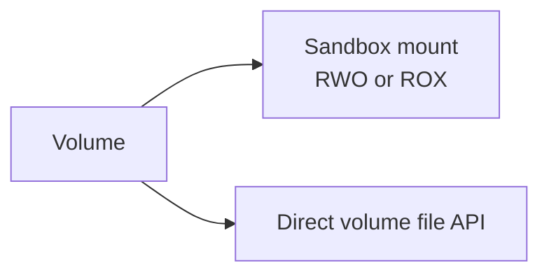

# Volume

Volume provides persistent storage for Sandbox0. It is a storage unit independent of the Sandbox lifecycle, allowing data sharing and reuse across multiple Sandboxes.

## Why Volumes?

The default Sandbox writable filesystem is checkpointed across pause/resume for the same Sandbox identity. Sandbox rootfs snapshots and forks can preserve or branch that rootfs state, but they still operate at the sandbox rootfs boundary. Volumes solve the cases where data must be mounted by multiple Sandboxes or accessed directly through storage APIs:

- **Data Persistence**: Store data that needs long-term retention, such as databases, model files, and user uploads
- **Cross-Sandbox Sharing**: Mount the same Volume to multiple Sandboxes for data sharing
- **Fast Snapshots**: Create point-in-time snapshots in seconds for backup and versioning
- **Fast Forking**: Create independent child Volumes with Copy-on-Write isolation
- **Quick Recovery**: Restore from snapshots quickly, ideal for rollbacks and environment cloning

| Storage surface | Survives pause/resume | Survives sandbox delete or `hard_ttl` | Shareable | Snapshots and forks | Direct file API |
|-----------------|-----------------------|----------------------------------------|-----------|---------------------|-----------------|
| Sandbox root filesystem | Yes, after checkpointed pause | Only through named rootfs snapshots or forks | No | Yes, through [Snapshot And Restore](/docs/sandbox/snapshot-restore) | Through the Sandbox file API while the Sandbox exists |
| Sandbox Volume | Yes | Yes, until the Volume is deleted | Yes | Yes | Yes |

## Volume and Sandbox Relationship

## Access Modes

Volumes support three access modes:

| Mode | Full Name | Description | Typical Use Cases |
|------|-----------|-------------|-------------------|
| `RWO` | Read-Write Once | One writable owner at a time | Agent workspaces, databases, exclusive write-heavy state |
| `ROX` | Read-Only Cross | Multi-sandbox read-only distribution | Shared model files, static assets, reference datasets |
| `RWX` | Read-Write Cross | Shared read-write volume mode for direct API workflows | Control-plane style file workflows and shared storage patterns that do not rely on sandbox mounts |

<Callout variant="info">
The default access mode is `RWO`. Sandbox mounts are declared by the template and bound at claim time. `RWO` mounts use node-local write-ahead logging for low-latency small-file workloads, `ROX` is for read-only sharing, and `RWX` is not accepted for sandbox mounts in the current node-local mount path.
</Callout>

## Volume Backends

The default backend is `s0fs`, Sandbox0's durable POSIX-oriented volume store backed by S3-compatible object storage. `s0fs` supports Sandbox mounts, direct file APIs, snapshots, restore, and forks.

Use `s0fs` when Sandbox0 should own the durable filesystem state, snapshots, and forks. Use `s3` when the source of truth is an existing S3-compatible bucket prefix and the Sandbox should see that prefix through the same ctld volume portal used by normal Sandbox mounts.

| Backend | Source of truth | Best for | Snapshot and fork support |
|---------|-----------------|----------|---------------------------|
| `s0fs` | Sandbox0-managed volume data | POSIX-oriented agent workspaces, small-file write-heavy state, snapshots, forks, direct volume file APIs | Yes |
| `s3` | Existing S3/OSS/R2 bucket prefix | Bidirectional access to object storage from a Sandbox mount | No |

Create an S3 backend volume with the SDKs or CLI:

<Tabs
  tabs={[
    {
      label: "Go",
      language: "go",
      code: `volume, err := client.CreateVolume(ctx, apispec.CreateSandboxVolumeRequest{
    Backend:    apispec.NewOptVolumeBackend(apispec.VolumeBackendS3),
    AccessMode: apispec.NewOptVolumeAccessMode(apispec.VolumeAccessModeRWO),
    S3: apispec.NewOptCreateSandboxVolumeS3Config(apispec.CreateSandboxVolumeS3Config{
        Provider: apispec.NewOptCreateSandboxVolumeS3ConfigProvider(
            apispec.CreateSandboxVolumeS3ConfigProviderAWS,
        ),
        Bucket: "sandbox-data",
        Prefix: apispec.NewOptString("team-a/workspace-a"),
        Region: apispec.NewOptString("us-east-1"),
    }),
})
if err != nil {
    log.Fatal(err)
}
fmt.Printf("S3 volume ID: %s\\n", volume.ID)`
    },
    {
      label: "Python",
      language: "python",
      code: `from sandbox0.apispec.models.create_sandbox_volume_request import CreateSandboxVolumeRequest
from sandbox0.apispec.models.create_sandbox_volume_s3_config import CreateSandboxVolumeS3Config
from sandbox0.apispec.models.create_sandbox_volume_s3_config_provider import CreateSandboxVolumeS3ConfigProvider
from sandbox0.apispec.models.volume_access_mode import VolumeAccessMode
from sandbox0.apispec.models.volume_backend import VolumeBackend

volume = client.volumes.create(CreateSandboxVolumeRequest(
    backend=VolumeBackend.S3,
    access_mode=VolumeAccessMode.RWO,
    s3=CreateSandboxVolumeS3Config(
        provider=CreateSandboxVolumeS3ConfigProvider.AWS,
        bucket="sandbox-data",
        prefix="team-a/workspace-a",
        region="us-east-1",
    ),
))
print(f"S3 volume ID: {volume.id}")`
    },
    {
      label: "TypeScript",
      language: "typescript",
      code: `import { models } from "sandbox0";

const volume = await client.volumes.create({
    backend: models.VolumeBackend.S3,
    accessMode: models.VolumeAccessMode.Rwo,
    s3: {
        provider: models.CreateSandboxVolumeS3ConfigProviderEnum.Aws,
        bucket: "sandbox-data",
        prefix: "team-a/workspace-a",
        region: "us-east-1",
    },
});
console.log("S3 volume ID:", volume.id);`
    },
    {
      label: "CLI",
      language: "bash",
      code: `s0 volume create \\
  --backend s3 \\
  --access-mode RWO \\
  --s3-provider aws \\
  --s3-bucket sandbox-data \\
  --s3-prefix team-a/workspace-a \\
  --s3-region us-east-1 \\
  -o json`
    }
  ]}
/>

`provider` can be `aws`, `ali`, or `r2`. Use `ali` for Aliyun OSS and `r2` for Cloudflare R2. `endpoint_url` is required for `ali` and `r2`; credentials can be provided per volume with `access_key`, `secret_key`, and optional `session_token`, or inherited from the storage-proxy configuration when omitted.

The `s3` backend is mount-s3-like rather than a full `s0fs` replacement:

- object keys are projected into directories using `/`
- directory entries are synthetic, or represented by zero-byte marker objects ending in `/`
- new files are written back to S3 on close, flush, or fsync
- external S3 object changes are visible through the mounted path on later lookup/read/list operations
- Writable opens replace the target object and must write sequentially; random in-place overwrites are not supported
- `RWX`, snapshots, restore, forks, direct file APIs without an active mounted owner, rename, hard links, symlinks, xattrs, locks, and fallocate are not supported

When a `s3` volume is actively mounted, direct volume file API requests can still be proxied to that active ctld owner. When it is not mounted, use S3 APIs directly or mount it into a Sandbox first.

## Correctness Model

For mounted `RWO` volumes, Sandbox0 keeps one active writable owner at a time.

- when a sandbox mounts an `RWO` volume, the node-local mount owner becomes authoritative for reads and writes
- direct volume file API requests are routed to that mounted owner instead of opening a second writable mount
- when the volume is not mounted into a sandbox, `storage-proxy` serves direct file API requests itself

This keeps the mounted filesystem view and the direct volume API view consistent in both directions.

## Application-Layer Encryption

Sandbox0 encrypts persisted S0FS volume data at the application layer before it is written to object storage.

Manifest objects are encrypted as full blobs. Segment objects are encrypted in independently authenticated chunks, so cold file reads can still fetch only the ciphertext chunks needed for the requested byte range. Node-local cache files, including the S0FS WAL, head state, and snapshot state, are also encrypted before they are written to disk.

<Callout variant="info">
This is service-side application-layer encryption. `storage-proxy` and `ctld` hold the volume encryption key so they can serve normal POSIX filesystem reads and writes. It is not end-to-end encryption where Sandbox0 services cannot decrypt volume data.
</Callout>

For self-hosted deployments, see [Self-hosted Configuration](/docs/sandbox/self-hosted/configuration) for the storage-proxy encryption setting.

## Direct File Operations

You can operate on files in a Volume directly by volume ID, without mounting the Volume into a Sandbox first.

This is useful for SDK workflows, developer tooling, and small control-plane style file tasks where starting or reusing a Sandbox would only add latency.

<Callout variant="info">
Direct volume file APIs still go through the normal gateway chain and team-scoped auth. When a volume is already mounted into a sandbox, the API request is served by that mounted owner. When it is not mounted, `storage-proxy` lazily attaches the volume on demand and reclaims idle direct mounts later.
</Callout>

The direct file API surface mirrors the Sandbox file API:

| Operation | Endpoint |
|-----------|----------|
| Read / Write / Delete | `GET`, `POST`, `DELETE /api/v1/sandboxvolumes/{'{id}'}/files?path=...` |
| Stat | `GET /api/v1/sandboxvolumes/{'{id}'}/files/stat?path=...` |
| List directory | `GET /api/v1/sandboxvolumes/{'{id}'}/files/list?path=...` |
| Move / Rename | `POST /api/v1/sandboxvolumes/{'{id}'}/files/move` |
| Watch | `GET /api/v1/sandboxvolumes/{'{id}'}/files/watch` |

Paths are always resolved relative to the root of the Volume namespace.

For SDK, CLI, and direct HTTP file workflows, see the dedicated [Volume HTTP](./http) page.

---

## Create Volume

Create a new persistent volume with an access mode.

<Endpoint method="POST">
/api/v1/sandboxvolumes
</Endpoint>

<Tabs
  tabs={[
    {
      label: "Go",
      language: "go",
      code: `volume, err := client.CreateVolume(ctx, apispec.CreateSandboxVolumeRequest{
    AccessMode: apispec.NewOptVolumeAccessMode(apispec.VolumeAccessModeRWO),
})
if err != nil {
    log.Fatal(err)
}
fmt.Printf("Volume ID: %s\\n", volume.ID)`
    },
    {
      label: "Python",
      language: "python",
      code: `from sandbox0.apispec.models.create_sandbox_volume_request import CreateSandboxVolumeRequest
from sandbox0.apispec.models.volume_access_mode import VolumeAccessMode
    
volume = client.volumes.create(CreateSandboxVolumeRequest(
    access_mode=VolumeAccessMode.RWO,
))
print(f"Volume ID: {volume.id}")`
    },
    {
      label: "TypeScript",
      language: "typescript",
      code: `import { models } from "sandbox0";

const volume = await client.volumes.create({
    accessMode: models.VolumeAccessMode.Rwo,
});
console.log("Volume ID:", volume.id);`
    },
    {
      label: "CLI",
      language: "bash",
      code: `# Create a volume
s0 volume create --access-mode RWO

# For automation, prefer machine-readable output
s0 volume create --access-mode RWO -o json`
    }
  ]}
/>

---

## Get Volume Details

Retrieve a specific volume by ID.

<Endpoint method="GET">
/api/v1/sandboxvolumes/{'{id}'}
</Endpoint>

<Tabs
  tabs={[
    {
      label: "Go",
      language: "go",
      code: `vol, err := client.GetVolume(ctx, volume.ID)
if err != nil {
    log.Fatal(err)
}
fmt.Printf("Volume: %s (backend: %s)\\n", vol.ID, vol.Backend)`
    },
    {
      label: "Python",
      language: "python",
      code: `vol = client.volumes.get(volume.id)
print(f"Volume: {vol.id} (backend: {vol.backend})")`
    },
    {
      label: "TypeScript",
      language: "typescript",
      code: `const vol = await client.volumes.get(volume.id);
console.log("Volume:", vol.id, "backend:", vol.backend);`
    },
    {
      label: "CLI",
      language: "bash",
      code: `s0 volume get vol_abc123xyz`
    }
  ]}
/>

---

## List Volumes

List all volumes in the current team.

<Endpoint method="GET">
/api/v1/sandboxvolumes
</Endpoint>

<Tabs
  tabs={[
    {
      label: "Go",
      language: "go",
      code: `volumes, err := client.ListVolume(ctx)
if err != nil {
    log.Fatal(err)
}
for _, v := range volumes {
    fmt.Printf("- %s (%s)\\n", v.ID, v.Backend)
}`
    },
    {
      label: "Python",
      language: "python",
      code: `volumes = client.volumes.list()
for vol in volumes:
    print(f"- {vol.id} ({vol.backend})")`
    },
    {
      label: "TypeScript",
      language: "typescript",
      code: `const volumes = await client.volumes.list();
for (const vol of volumes) {
    console.log(vol.id, vol.backend);
}`
    },
    {
      label: "CLI",
      language: "bash",
      code: `s0 volume list`
    }
  ]}
/>

## Delete Volume

Delete a volume when it is no longer needed.

<Endpoint method="DELETE">
/api/v1/sandboxvolumes/{'{id}'}
</Endpoint>

<Tabs
  tabs={[
    {
      label: "Go",
      language: "go",
      code: `_, err = client.DeleteVolume(ctx, volume.ID)
if err != nil {
    log.Fatal(err)
}
fmt.Println("Volume deleted")`
    },
    {
      label: "Python",
      language: "python",
      code: `client.volumes.delete(volume.id)
print("Volume deleted")`
    },
    {
      label: "TypeScript",
      language: "typescript",
      code: `await client.volumes.delete(volume.id);
console.log("Volume deleted");`
    },
    {
      label: "CLI",
      language: "bash",
      code: `s0 volume delete vol_abc123xyz`
    }
  ]}
/>

## Next Steps

<CardGroup>
  <Card title="Mounts" href="/docs/sandbox/volume/mounts" cta="Continue">
    Mount volumes into sandbox templates and claims with correct access modes.
  </Card>

  <Card title="HTTP" href="/docs/sandbox/volume/http" cta="Continue">
    Use direct volume file APIs outside a running sandbox mount.
  </Card>
</CardGroup>
