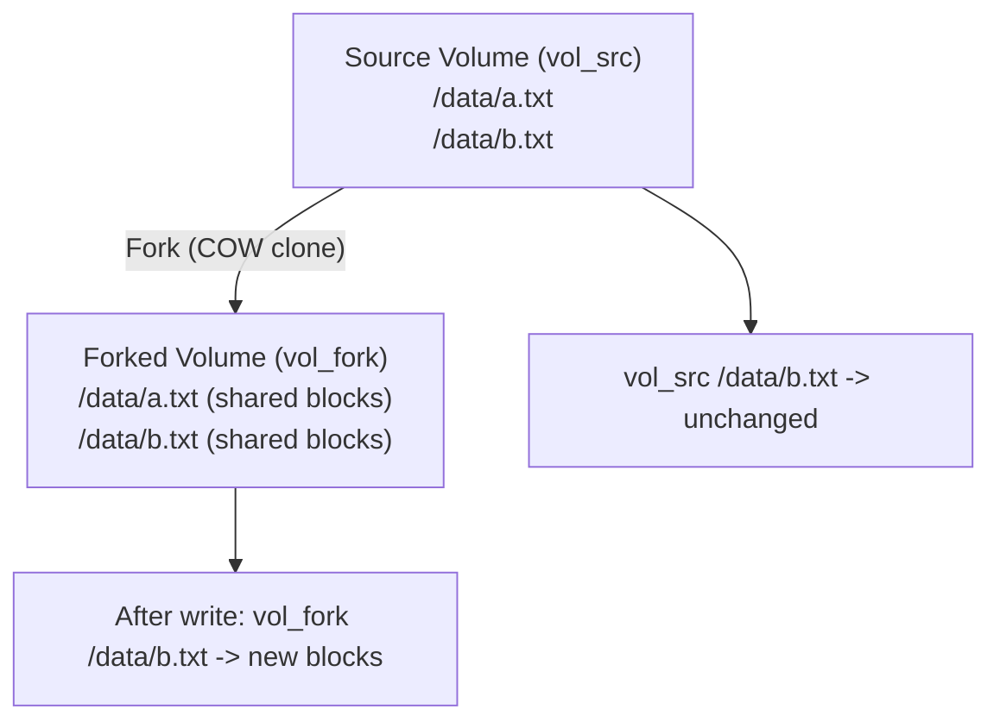

# Volume Fork

Volume Fork creates a new Volume from an existing Volume using JuiceFS Copy-on-Write (COW) clone.

## Why Use Fork?

- **Fast Clone**: Create a new Volume quickly without copying all data blocks
- **Storage Efficient**: Source and fork share unchanged data blocks
- **Write Isolation**: Writes to the fork do not affect the source Volume
- **Great for Branching**: Create per-task or per-experiment data branches

## How Fork Works

## API

- **Endpoint**: `POST /api/v1/sandboxvolumes/{id}/fork`
- **Path Parameter**: `id` is the source Volume ID
- **Request Body**: Optional, used to override inherited configuration from the source Volume
- **Success Response**: `201 Created`, returns the new `SandboxVolume` including `source_volume_id`
- **Common Errors**: `400` (invalid `access_mode`), `404` (source Volume not found or not visible to your team)

## Optional Request Fields

| Field | Type | Description |
|------|------|-------------|
| `access_mode` | enum | Access mode for the forked Volume. If omitted, defaults to `RWO` |
| `cache_size` | string | Cache size for the forked Volume. If omitted, inherits from source Volume |
| `buffer_size` | string | Buffer size for the forked Volume. If omitted, inherits from source Volume |
| `prefetch` | integer | Number of blocks to prefetch. If omitted, inherits from source Volume |
| `writeback` | boolean | Enable or disable write-back cache. If omitted, inherits from source Volume |

## Fork a Volume

<Tabs
  tabs={[
    {
      label: "Go",
      language: "go",
      code: `forked, err := client.ForkVolume(ctx, volume.ID, &apispec.ForkVolumeRequest{
    AccessMode: apispec.NewOptVolumeAccessMode(apispec.VolumeAccessModeRWO),
    CacheSize:  apispec.NewOptString("2G"),
    BufferSize: apispec.NewOptString("64M"),
    Prefetch:   apispec.NewOptInt(10),
    Writeback:  apispec.NewOptBool(false),
})
if err != nil {
    panic(err)
}

fmt.Printf("Forked Volume: %s\n", forked.ID)
if sourceVolumeID, ok := forked.SourceVolumeID.Get(); ok {
    fmt.Printf("Source Volume: %s\n", sourceVolumeID)
} else {
    fmt.Println("Source Volume: <nil>")
}`
    },
    {
      label: "Python",
      language: "python",
      code: `from sandbox0.apispec.models.fork_volume_request import ForkVolumeRequest
from sandbox0.apispec.types import Unset

forked = client.volumes.fork(
    volume.id,
    ForkVolumeRequest(
        access_mode=VolumeAccessMode.RWO,
        cache_size="2G",
        buffer_size="64M",
        prefetch=10,
        writeback=False,
    ),
)

print(f"Forked Volume: {forked.id}")
source_volume_id = forked.source_volume_id
if isinstance(source_volume_id, Unset) or source_volume_id is None:
    print("Source Volume: <nil>")
else:
    print(f"Source Volume: {source_volume_id}")`
    },
    {
      label: "TypeScript",
      language: "typescript",
      code: `const forked = await client.volumes.fork(volume.id, {
    accessMode: models.VolumeAccessMode.Rwo,
    cacheSize: "2G",
    bufferSize: "64M",
    prefetch: 10,
    writeback: false,
});

console.log("Forked Volume:", forked.id);
if (forked.sourceVolumeId) {
    console.log("Source Volume:", forked.sourceVolumeId);
} else {
    console.log("Source Volume: <nil>");
}`
    },
    {
      label: "CLI",
      language: "bash",
      code: `# Fork a volume with default settings
s0 volume fork <source-volume-id>

# Fork with configuration overrides
s0 volume fork <source-volume-id> \\
    --access-mode RWX \\
    --cache-size 2G \\
    --buffer-size 64M \\
    --prefetch 10 \\
    --writeback false`
    }
  ]}
/>

## Verify Isolation

1. Mount both the source and the forked Volume to a Sandbox at different paths.
2. Modify a file only in the forked Volume.
3. Read the same file from the source Volume and verify it is unchanged.

<Callout variant="info">
Fork uses COW at the filesystem metadata layer, so unchanged data is shared while changed data is isolated.
</Callout>

<Callout variant="info">
Fork does not require the source Volume to be mounted.
</Callout>

---

## Next Steps

<CardGrid>
  <LinkCard
    title="Self Hosted"
    href="/docs/deploy/self-hosted"
    cta="Learn More"
  >
    Deploy Sandbox0 on your own infrastructure
  </LinkCard>

  <LinkCard
    title="Snapshots"
    href="/docs/volume/snapshots"
    cta="Learn More"
  >
    Create and restore volume snapshots
  </LinkCard>

  <LinkCard
    title="Volume Overview"
    href="/docs/volume"
    cta="Learn More"
  >
    Volume lifecycle and configuration
  </LinkCard>
</CardGrid>
