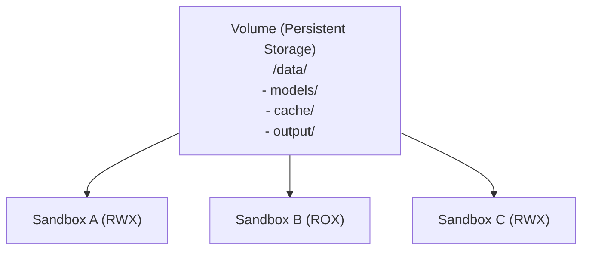

# Volume

Volume provides persistent storage for Sandbox0. It is a storage unit independent of the Sandbox lifecycle, allowing data sharing and reuse across multiple Sandboxes.

## Why Volumes?

The default Sandbox filesystem is ephemeral—when a Sandbox is deleted, all its data is lost. Volumes solve this problem:

- **Data Persistence**: Store data that needs long-term retention, such as databases, model files, and user uploads
- **Cross-Sandbox Sharing**: Mount the same Volume to multiple Sandboxes for data sharing
- **Fast Snapshots**: Create point-in-time snapshots in seconds for backup and versioning
- **Fast Forking**: Create independent child Volumes with Copy-on-Write isolation
- **Quick Recovery**: Restore from snapshots quickly, ideal for rollbacks and environment cloning

## Volume and Sandbox Relationship

## Access Modes

Volumes support three access modes:

| Mode | Full Name | Description | Typical Use Cases |
|------|-----------|-------------|-------------------|
| `RWO` | Read-Write Once | Single Sandbox read-write | Database storage, exclusive workspaces |
| `ROX` | Read-Only Cross | Multi-Sandbox read-only | Shared model files, static resource distribution |
| `RWX` | Read-Write Cross | Multi-Sandbox read-write | Collaborative workspaces, shared caches |

<Callout variant="info">
The default access mode is `RWO`. Specify `RWX` mode when creating a Volume if you need cross-Sandbox sharing.
</Callout>

## Performance Configuration

Volumes support the following performance tuning parameters:

| Parameter | Type | Description | Example Values |
|-----------|------|-------------|----------------|
| `cache_size` | string | Cache size (default: `1G`) | `512M`, `1G` |
| `buffer_size` | string | Buffer size (default: `32M`) | `32M`, `128M`, `256M` |
| `prefetch` | integer | Number of blocks to prefetch (default: `0`) | `0`, `1`, `2`, `4` |
| `writeback` | boolean | Enable write-back cache (default: `false`) | `true`, `false` |

<Callout variant="warning">
Enabling `writeback` improves write performance but may lose unwritten data in exceptional cases. Disable it for scenarios requiring strong data consistency.
</Callout>

---

## Create Volume

Create a new persistent volume with access mode and optional performance config.

<Endpoint method="POST">
/api/v1/sandboxvolumes
</Endpoint>

<Tabs
  tabs={[
    {
      label: "Go",
      language: "go",
      code: `volume, err := client.CreateVolume(ctx, apispec.CreateSandboxVolumeRequest{
    AccessMode: apispec.NewOptVolumeAccessMode(apispec.VolumeAccessModeRWX),
    CacheSize:  apispec.NewOptString("1G"),
    BufferSize: apispec.NewOptString("128M"),
})
if err != nil {
    log.Fatal(err)
}
fmt.Printf("Volume ID: %s\\n", volume.ID)`
    },
    {
      label: "Python",
      language: "python",
      code: `from sandbox0.apispec.models.create_sandbox_volume_request import CreateSandboxVolumeRequest
from sandbox0.apispec.models.volume_access_mode import VolumeAccessMode
    
volume = client.volumes.create(CreateSandboxVolumeRequest(
    access_mode=VolumeAccessMode.RWX,
    cache_size="1G",
    buffer_size="128M",
))
print(f"Volume ID: {volume.id}")`
    },
    {
      label: "TypeScript",
      language: "typescript",
      code: `import { models } from "sandbox0";

const volume = await client.volumes.create({
    accessMode: models.VolumeAccessMode.Rwx,
    cacheSize: "1G",
    bufferSize: "128M",
});
console.log("Volume ID:", volume.id);`
    },
    {
      label: "CLI",
      language: "bash",
      code: `# Create a volume with performance tuning
s0 volume create --access-mode RWX --cache-size 1G --buffer-size 128M

# For automation, prefer machine-readable output
s0 volume create --access-mode RWX -o json`
    }
  ]}
/>

---

## Get Volume Details

Retrieve a specific volume by ID.

<Endpoint method="GET">
/api/v1/sandboxvolumes/{'{id}'}
</Endpoint>

<Tabs
  tabs={[
    {
      label: "Go",
      language: "go",
      code: `vol, err := client.GetVolume(ctx, volume.ID)
if err != nil {
    log.Fatal(err)
}
fmt.Printf("Volume: %s (mode: %s)\\n", vol.ID, vol.AccessMode.Value)`
    },
    {
      label: "Python",
      language: "python",
      code: `vol = client.volumes.get(volume.id)
print(f"Volume: {vol.id} (mode: {vol.access_mode})")`
    },
    {
      label: "TypeScript",
      language: "typescript",
      code: `const vol = await client.volumes.get(volume.id);
console.log("Volume:", vol.id, "mode:", vol.accessMode);`
    },
    {
      label: "CLI",
      language: "bash",
      code: `s0 volume get vol_abc123xyz`
    }
  ]}
/>

---

## List Volumes

List all volumes in the current team.

<Endpoint method="GET">
/api/v1/sandboxvolumes
</Endpoint>

<Tabs
  tabs={[
    {
      label: "Go",
      language: "go",
      code: `volumes, err := client.ListVolume(ctx)
if err != nil {
    log.Fatal(err)
}
for _, v := range volumes {
    fmt.Printf("- %s (%s)\\n", v.ID, v.AccessMode.Value)
}`
    },
    {
      label: "Python",
      language: "python",
      code: `volumes = client.volumes.list()
for vol in volumes:
    print(f"- {vol.id} ({vol.access_mode})")`
    },
    {
      label: "TypeScript",
      language: "typescript",
      code: `const volumes = await client.volumes.list();
for (const vol of volumes) {
    console.log(\`- \${vol.id} (\${vol.accessMode})\`);
}`
    },
    {
      label: "CLI",
      language: "bash",
      code: `s0 volume list`
    }
  ]}
/>

## Delete Volume

Delete a volume when it is no longer needed.

<Endpoint method="DELETE">
/api/v1/sandboxvolumes/{'{id}'}
</Endpoint>

<Tabs
  tabs={[
    {
      label: "Go",
      language: "go",
      code: `_, err = client.DeleteVolume(ctx, volume.ID)
if err != nil {
    log.Fatal(err)
}
fmt.Println("Volume deleted")`
    },
    {
      label: "Python",
      language: "python",
      code: `client.volumes.delete(volume.id)
print("Volume deleted")`
    },
    {
      label: "TypeScript",
      language: "typescript",
      code: `await client.volumes.delete(volume.id);
console.log("Volume deleted");`
    },
    {
      label: "CLI",
      language: "bash",
      code: `s0 volume delete vol_abc123xyz`
    }
  ]}
/>

---

## Persist Runtime Environment with Nix

You can use **Nix + Volume** to persist and reuse your **runtime environment artifacts** across Sandboxes.

- **Can persist**: dependency closures, build caches, package stores, lock files, and workspace-level toolchains
- **Cannot persist**: live process runtime state (in-memory variables, process stacks, open sockets, PID state)

This means:
- A new Sandbox can quickly reproduce the same environment from mounted Volume data
- But it still starts as a new process runtime, not a paused/resumed OS process image

---

## Next Steps

<CardGrid>
  <LinkCard
    title="Volume Mounts"
    href="/docs/volume/mounts"
    cta="Learn More"
  >
    Mount volumes to sandboxes for persistent storage
  </LinkCard>

  <LinkCard
    title="Snapshots"
    href="/docs/volume/snapshots"
    cta="Learn More"
  >
    Create, restore, and manage volume snapshots
  </LinkCard>

  <LinkCard
    title="Volume Fork"
    href="/docs/volume/fork"
    cta="Learn More"
  >
    Clone a volume with Copy-on-Write isolation
  </LinkCard>

  <LinkCard
    title="Sandbox"
    href="/docs/sandbox"
    cta="Learn More"
  >
    Sandbox lifecycle and execution management
  </LinkCard>
</CardGrid>
