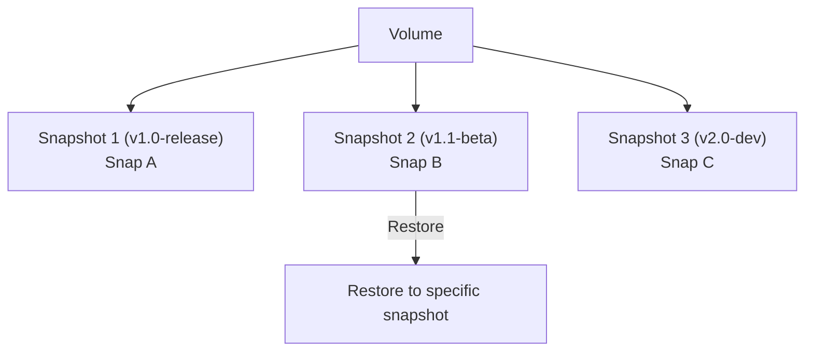

# Volume Snapshots

A Snapshot is a point-in-time, read-only copy of a Volume. Snapshots are designed for backup, rollback, and reproducible environments.

## Snapshot Features

- **Instant Creation**: Built on Copy-on-Write semantics, snapshot creation is near-instant
- **Space Efficiency**: Built on JuiceFS clone semantics (Copy-on-Write), so snapshots avoid full data copies
- **Fast Recovery**: Restore operations quickly roll data back to a known state
- **Version Traceability**: Snapshot names and descriptions support release workflows

## Snapshot Lifecycle

## Create a Snapshot

<Tabs
  tabs={[
    {
      label: "Go",
      language: "go",
      code: `volume, err := client.CreateVolume(ctx, apispec.CreateSandboxVolumeRequest{
    AccessMode: apispec.NewOptVolumeAccessMode(apispec.VolumeAccessModeRWX),
    CacheSize:  apispec.NewOptString("1G"),
    BufferSize: apispec.NewOptString("128M"),
})
if err != nil {
    log.Fatal(err)
}
fmt.Printf("Volume ID: %s\\n", volume.ID)

// Create snapshot with description
snapshot, err := client.CreateVolumeSnapshot(ctx, volume.ID, apispec.CreateSnapshotRequest{
    Name:        "v1.1-beta",
    Description: apispec.NewOptString("Feature: Added user authentication module"),
})
if err != nil {
    panic(err)
}
fmt.Printf("Snapshot created: %s (%s)\\n", snapshot.ID, snapshot.Name)`
    },
    {
      label: "Python",
      language: "python",
      code: `from sandbox0.apispec.models.create_snapshot_request import CreateSnapshotRequest
from sandbox0.apispec.models.create_sandbox_volume_request import CreateSandboxVolumeRequest
from sandbox0.apispec.models.volume_access_mode import VolumeAccessMode

volume = client.volumes.create(CreateSandboxVolumeRequest(
    access_mode=VolumeAccessMode.RWX,
    cache_size="1G",
    buffer_size="128M",
))
print(f"Volume ID: {volume.id}")

# Create snapshot with description
snapshot = client.volumes.create_snapshot(
    volume.id,
    CreateSnapshotRequest(
        name="v1.1-beta",
        description="Feature: Added user authentication module",
    ),
)
print(f"Snapshot created: {snapshot.id} ({snapshot.name})")`
    },
    {
      label: "TypeScript",
      language: "typescript",
      code: `var volume = await client.volumes.create({
    accessMode: models.VolumeAccessMode.Rwx,
    cacheSize: "1G",
    bufferSize: "128M",
});
console.log("Volume ID:", volume.id);

// Create snapshot with description
var snapshot = await client.volumes.createSnapshot(volume.id, {
    name: "v1.1-beta",
    description: "Feature: Added user authentication module",
});
console.log("Snapshot created:", snapshot.id, snapshot.name);`
    },
    {
      label: "CLI",
      language: "bash",
      code: `# Create snapshot with name only
s0 volume snapshot create vol_abc123xyz --name "v1.0-release"

# Create snapshot with description
s0 volume snapshot create vol_abc123xyz \
  --name "v1.1-beta" \
  --description "Feature: Added user authentication module"

# For automation scripts, prefer JSON output:
s0 volume snapshot create vol_abc123xyz --name "v1.2-prod" -o json`
    }
  ]}
/>

## List Snapshots

<Callout variant="info">
`size_bytes` is currently a logical metadata field from the API and may be `0`. Use storage backend metrics for physical usage accounting.
</Callout>

<Tabs
  tabs={[
    {
      label: "Go",
      language: "go",
      code: `snapshots, err := client.ListVolumeSnapshots(ctx, volume.ID)
if err != nil {
    panic(err)
}
fmt.Printf("Total snapshots: %d\\n", len(snapshots))
for _, snap := range snapshots {
    fmt.Printf("  - %s: %s (size_bytes=%d)\\n", snap.ID, snap.Name, snap.SizeBytes)
}`
    },
    {
      label: "Python",
      language: "python",
      code: `snapshots = client.volumes.list_snapshots(volume.id)
print(f"Total snapshots: {len(snapshots)}")
for snap in snapshots:
    print(f"  - {snap.id}: {snap.name} (size_bytes={snap.size_bytes})")`
    },
    {
      label: "TypeScript",
      language: "typescript",
      code: `const snapshots = await client.volumes.listSnapshots(volume.id);
console.log("Total snapshots:", snapshots.length);
for (const snap of snapshots) {
    console.log(\`  - \${snap.id}: \${snap.name} (size_bytes=\${snap.sizeBytes})\`);
}`
    },
    {
      label: "CLI",
      language: "bash",
      code: `s0 volume snapshot list vol_abc123xyz`
    }
  ]}
/>

## Get Snapshot Details

<Tabs
  tabs={[
    {
      label: "Go",
      language: "go",
      code: `snapshot, err = client.GetVolumeSnapshot(ctx, volume.ID, snapshot.ID)
if err != nil {
    panic(err)
}
fmt.Printf("Snapshot ID: %s\\n", snapshot.ID)
fmt.Printf("Name: %s\\n", snapshot.Name)
fmt.Printf("Description: %s\\n", snapshot.Description.Value)
fmt.Printf("Size: %d bytes\\n", snapshot.SizeBytes)
fmt.Printf("Created At: %s\\n", snapshot.CreatedAt)`
    },
    {
      label: "Python",
      language: "python",
      code: `snapshot = client.volumes.get_snapshot(volume.id, snapshot.id)
print(f"Snapshot ID: {snapshot.id}")
print(f"Name: {snapshot.name}")
print(f"Description: {snapshot.description}")
print(f"Size: {snapshot.size_bytes} bytes")
print(f"Created At: {snapshot.created_at}")`
    },
    {
      label: "TypeScript",
      language: "typescript",
      code: `snapshot = await client.volumes.getSnapshot(volume.id, snapshot.id);
console.log("Snapshot ID:", snapshot.id);
console.log("Name:", snapshot.name);
console.log("Description:", snapshot.description);
console.log("Size:", snapshot.sizeBytes, "bytes");
console.log("Created At:", snapshot.createdAt);`
    },
    {
      label: "CLI",
      language: "bash",
      code: `s0 volume snapshot get vol_abc123xyz snap_def456uvw`
    }
  ]}
/>

## Restore a Snapshot

Restoring a snapshot rolls the Volume data back to the point when the snapshot was created.

<Callout variant="info">
The restore API returns `200` with `{status: "restored"}` on success. Runtime failures can include lock contention (`409`) and remount timeout (`504`).
</Callout>

<Callout variant="warning">
Restore is irreversible. All data changes made after the snapshot was created are lost. Create a new backup snapshot before restoring.
</Callout>

<Tabs
  tabs={[
    {
      label: "Go",
      language: "go",
      code: `// Execute restore
result, err := client.RestoreVolumeSnapshot(ctx, volume.ID, snapshot.ID)
if err != nil {
    panic(err)
}
status := "restored"
if data, ok := result.Data.Get(); ok {
    status = data.Status.Or(status)
}
fmt.Printf("Volume restore status: %s\\n", status)`
    },
    {
      label: "Python",
      language: "python",
      code: `# Create backup snapshot before restore
client.volumes.create_snapshot(
    volume.id,
    CreateSnapshotRequest(name="pre-restore-backup"),
)

# Execute restore
result = client.volumes.restore_snapshot(volume.id, snapshot.id)
print(f"Restore success: {result.success}")
if hasattr(result.data, "status"):
    print(f"Restore status: {result.data.status}")`
    },
    {
      label: "TypeScript",
      language: "typescript",
      code: `// Execute restore
const result = await client.volumes.restoreSnapshot(volume.id, snapshot.id);
console.log("Restore success:", result.success);
if (result.data?.status) {
    console.log("Restore status:", result.data.status);
}`
    },
    {
      label: "CLI",
      language: "bash",
      code: `# Create backup snapshot before restore
s0 volume snapshot create vol_abc123xyz --name "pre-restore-backup"

# Execute restore
s0 volume snapshot restore vol_abc123xyz snap_def456uvw`
    }
  ]}
/>

## Delete a Snapshot

<Callout variant="info">
Delete is idempotent in the current infra implementation: deleting an already-missing snapshot still returns success (`deleted: true`).
</Callout>

<Tabs
  tabs={[
    {
      label: "Go",
      language: "go",
      code: `_, err = client.DeleteVolumeSnapshot(ctx, volume.ID, snapshot.ID)
if err != nil {
    panic(err)
}
fmt.Println("Snapshot deleted")`
    },
    {
      label: "Python",
      language: "python",
      code: `client.volumes.delete_snapshot(volume.id, snapshot.id)
print("Snapshot deleted")`
    },
    {
      label: "TypeScript",
      language: "typescript",
      code: `await client.volumes.deleteSnapshot(volume.id, snapshot.id);
console.log("Snapshot deleted");`
    },
    {
      label: "CLI",
      language: "bash",
      code: `s0 volume snapshot delete vol_abc123xyz snap_def456uvw`
    }
  ]}
/>

<Callout variant="info">
Deleting a snapshot does not affect current Volume data. The live Volume state remains intact even if all snapshots are removed.
</Callout>

---

## Next Steps

<CardGrid>
  <LinkCard
    title="Volume Fork"
    href="/docs/volume/fork"
    cta="Learn More"
  >
    Clone a volume with Copy-on-Write isolation
  </LinkCard>

  <LinkCard
    title="Volume Mounts"
    href="/docs/volume/mounts"
    cta="Learn More"
  >
    Mount volumes to sandboxes for persistent data access
  </LinkCard>

  <LinkCard
    title="Volume Overview"
    href="/docs/volume"
    cta="Learn More"
  >
    Understand the full volume lifecycle and configuration
  </LinkCard>

</CardGrid>
