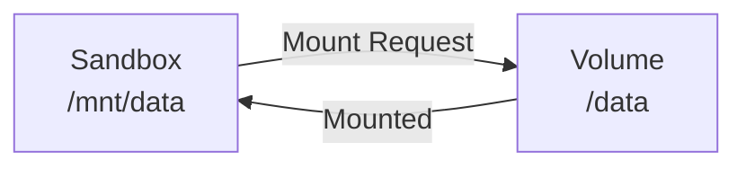

# Volume Mounts

After mounting a Volume to a Sandbox, you can access Volume data within the Sandbox just like a local filesystem.

## Mount Flow



## Mount a Volume

When mounting, you need to specify:
- `volume_id`: The Volume ID to mount
- `mount_point`: The mount path inside the Sandbox
- `volume_config` (optional): Performance configuration override at mount time

Mount point requirements from the current infra implementation:
- Must be an absolute path (for example `/mnt/data`)
- Cannot be root path (`/`)
- If the directory does not exist, it is created automatically

<Tabs
  tabs={[
    {
      label: "Go",
      language: "go",
      code: `volume, err := client.CreateVolume(ctx, apispec.CreateSandboxVolumeRequest{
    AccessMode: apispec.NewOptVolumeAccessMode(apispec.VolumeAccessModeRWX),
    CacheSize:  apispec.NewOptString("1G"),
    BufferSize: apispec.NewOptString("128M"),
})
if err != nil {
    log.Fatal(err)
}
fmt.Printf("Volume ID: %s\\n", volume.ID)

// Mount Volume to Sandbox
mountResp, err := sandbox.Mount(ctx, volume.ID, "/mnt/data", nil)
if err != nil {
    panic(err)
}
fmt.Printf("Volume mounted at %s\\n", mountResp.MountPoint)
fmt.Printf("Mount session ID: %s\\n", mountResp.MountSessionID)

// Operate files inside Sandbox
_, err = sandbox.WriteFile(ctx, "/mnt/data/hello.txt", []byte("Hello, Volume!"))
if err != nil {
    panic(err)
}
content, err := sandbox.ReadFile(ctx, "/mnt/data/hello.txt")
if err != nil {
    panic(err)
}
fmt.Printf("File content: %s\\n", string(content))`
    },
    {
      label: "Python",
      language: "python",
      code: `from sandbox0.apispec.models.create_sandbox_volume_request import CreateSandboxVolumeRequest
from sandbox0.apispec.models.volume_access_mode import VolumeAccessMode

volume = client.volumes.create(CreateSandboxVolumeRequest(
    access_mode=VolumeAccessMode.RWX,
    cache_size="1G",
    buffer_size="128M",
))
print(f"Volume ID: {volume.id}")

vol = client.volumes.get(volume.id)
print(f"Volume: {vol.id} (mode: {vol.access_mode})")

# Mount Volume
mount_session = sandbox.mount(volume.id, "/mnt/data")
print(f"Volume mounted at {mount_session.mount_point}")

# Operate files inside Sandbox
sandbox.write_file("/mnt/data/hello.txt", b"Hello, Volume!")
content = sandbox.read_file("/mnt/data/hello.txt")
print(f"File content: {content}")`
    },
    {
      label: "TypeScript",
      language: "typescript",
      code: `var volume = await client.volumes.create({
    accessMode: models.VolumeAccessMode.Rwx,
    cacheSize: "1G",
    bufferSize: "128M",
});
console.log("Volume ID:", volume.id);

// Mount Volume
const mountSession = await sandbox.mount(volume.id, '/mnt/data');
console.log('Volume mounted at', mountSession.mountPoint);
console.log('Mount session ID:', mountSession.mountSessionId);

// Operate files inside Sandbox
await sandbox.writeFile('/mnt/data/hello.txt', 'Hello, Volume!');
var content = await sandbox.readFile('/mnt/data/hello.txt');
console.log('File content:', Buffer.from(content).toString('utf-8'));`
    },
    {
      label: "CLI",
      language: "bash",
      code: `# Create Volume and Sandbox
s0 volume create
s0 sandbox create --template default

# Mount Volume to Sandbox
s0 sandbox volume mount \\
    --sandbox-id <sandbox-id> \\
    --volume-id <volume-id> \\
    --path /mnt/data

# Output includes mount_session_id for later unmount`
    }
  ]}
/>

## Bootstrap Mounts During Claim

If you already know which existing Volumes a sandbox should start with, you can include
bootstrap mounts directly in the sandbox claim request.

This is useful when a claimed sandbox should immediately open a pre-existing project
workspace or dataset.

The claim request accepts:

- `mounts[]`: existing volumes to mount into the sandbox
- `wait_for_mounts`: optional best-effort wait for the requested mounts to reach a terminal state
- `mount_wait_timeout_ms`: optional wait budget for `wait_for_mounts`

Cold-start note:

- By default, claim-time mounts are asynchronous bootstrap work.
- When `wait_for_mounts` is omitted or false, the claim API can return before mounts finish.
- Use `/api/v1/sandboxes/{'{'}id{'}'}/sandboxvolumes/status` or the SDK claim response to inspect
  mount state (`pending`, `mounting`, `mounted`, `failed`).

Example request:

```json
{
    "template": "default",
    "mounts": [
        {
            "sandboxvolume_id": "vol_123",
            "mount_point": "/workspace/data"
        }
    ],
    "wait_for_mounts": true,
    "mount_wait_timeout_ms": 30000
}
```

The claim response now includes `bootstrap_mounts`, so callers can tell whether requested
mounts are still pending, already mounted, or failed with an error.

<Tabs
  tabs={[
    {
      label: "Go",
      language: "go",
      code: `volume, err := client.CreateVolume(ctx, apispec.CreateSandboxVolumeRequest{})
if err != nil {
    log.Fatal(err)
}

sandbox, err := client.ClaimSandbox(
    ctx,
    "default",
    sandbox0.WithSandboxBootstrapMount(volume.ID, "/workspace/data", nil),
    sandbox0.WithSandboxBootstrapMountWait(30*time.Second),
)
if err != nil {
    log.Fatal(err)
}

for _, mount := range sandbox.BootstrapMounts {
    fmt.Printf("Volume: %s, Path: %s, State: %s\\n", mount.SandboxvolumeID, mount.MountPoint, mount.State)
}`
    },
    {
      label: "Python",
      language: "python",
      code: `from sandbox0.apispec.models.claim_mount_request import ClaimMountRequest
from sandbox0.apispec.models.create_sandbox_volume_request import CreateSandboxVolumeRequest

volume = client.volumes.create(CreateSandboxVolumeRequest())

sandbox = client.sandboxes.claim(
    "default",
    mounts=[
        ClaimMountRequest(
            sandboxvolume_id=volume.id,
            mount_point="/workspace/data",
        )
    ],
    wait_for_mounts=True,
    mount_wait_timeout_ms=30000,
)

for mount in sandbox.bootstrap_mounts:
    print(f"Volume: {mount.sandboxvolume_id}, Path: {mount.mount_point}, State: {mount.state}")`
    },
    {
      label: "TypeScript",
      language: "typescript",
      code: `const volume = await client.volumes.create({});

const sandbox = await client.sandboxes.claim('default', {
    mounts: [
        {
            sandboxvolumeId: volume.id,
            mountPoint: '/workspace/data',
        },
    ],
    waitForMounts: true,
    mountWaitTimeoutMs: 30000,
});

for (const mount of sandbox.bootstrapMounts) {
    console.log('Volume:', mount.sandboxvolumeId, 'Path:', mount.mountPoint, 'State:', mount.state);
}`
    },
    {
      label: "CLI",
      language: "bash",
      code: `# Create a sandbox that bootstraps an existing Volume mount
s0 sandbox create \
    --template default \
    --mount vol_123:/workspace/data \
    --wait-for-mounts \
    --mount-wait-timeout-ms 30000`
    }
  ]}
/>

## Override Performance Config at Mount Time

You can specify different performance parameters than the Volume's default:

<Tabs
  tabs={[
    {
      label: "Go",
      language: "go",
      code: `//_, err = sandbox.Mount(ctx, volume.ID, "/mnt/data", &apispec.VolumeConfig{
//	CacheSize:  apispec.NewOptString("1G"),
//	BufferSize: apispec.NewOptString("256M"),
//	Prefetch:   apispec.NewOptInt32(4),
//	Writeback:  apispec.NewOptBool(false),
//})
//if err != nil {
//	panic(err)
//}`
    },
    {
      label: "Python",
      language: "python",
      code: `#from sandbox0.apispec.models.volume_config import VolumeConfig
#
#mount_session = sandbox.mount(
#    volume.id,
#    "/mnt/data",
#    config=VolumeConfig(
#        cache_size="1G",
#        buffer_size="256M",
#        prefetch=4,
#        writeback=False,
#    ),
#)`
    },
    {
      label: "TypeScript",
      language: "typescript",
      code: `//const mountSession = await sandbox.mount(volume.id, '/mnt/data', {
//  cacheSize: '1G',
//  bufferSize: '256M',
//  prefetch: 4,
//  writeback: false,
//});`
    },
    {
      label: "CLI",
      language: "bash",
      code: `# Mount with performance config override
s0 sandbox volume mount \\
    --sandbox-id <sandbox-id> \\
    --volume-id <volume-id> \\
    --path /mnt/data \\
    --cache-size 1G \\
    --buffer-size 256M \\
    --prefetch 4 \\
    --writeback false`
    }
  ]}
/>

## Query Mount Status

<Tabs
  tabs={[
    {
      label: "Go",
      language: "go",
      code: `mounts, err := sandbox.MountStatus(ctx)
if err != nil {
    panic(err)
}
for _, mount := range mounts {
    fmt.Printf("Volume: %s, Path: %s, Session: %s, State: %s\\n", mount.SandboxvolumeID, mount.MountPoint, mount.MountSessionID, mount.State)
}`
    },
    {
      label: "Python",
      language: "python",
      code: `mounts = sandbox.mount_status()
for mount in mounts:
    print(f"Volume: {mount.sandboxvolume_id}, Path: {mount.mount_point}, Session: {mount.mount_session_id}")`
    },
    {
      label: "TypeScript",
      language: "typescript",
      code: `const mounts = await sandbox.mountStatus();

for (const mount of mounts) {
    console.log('Volume:', mount.sandboxvolumeId, 'Path:', mount.mountPoint, 'Session:', mount.mountSessionId);
}`
    },
    {
      label: "CLI",
      language: "bash",
      code: `# Query mount status for a sandbox
s0 sandbox volume status --sandbox-id <sandbox-id>

# Output shows volume_id, mount_point, state, mount_session_id, and any mount error`
    }
  ]}
/>

## Unmount a Volume

When unmounting, provide the `mount_session_id` returned from the mount operation:

<Tabs
  tabs={[
    {
      label: "Go",
      language: "go",
      code: `_, err = sandbox.Unmount(ctx, volume.ID, mountResp.MountSessionID)
if err != nil {
    panic(err)
}`
    },
    {
      label: "Python",
      language: "python",
      code: `sandbox.unmount(volume.id, mount_session.mount_session_id)

## Or use context manager for auto-unmount
#with sandbox.mount(volume.id, "/mnt/data"):
#    # Use volume here
#    pass
#    # Auto-unmount when exiting context`
    },
    {
      label: "TypeScript",
      language: "typescript",
      code: `await sandbox.unmount(volume.id, mountSession.mountSessionId);`
    },
    {
      label: "CLI",
      language: "bash",
      code: `# Unmount requires mount_session_id from mount response
s0 sandbox volume unmount \\
    --sandbox-id <sandbox-id> \\
    --volume-id <volume-id> \\
    --session-id <mount-session-id>`
    }
  ]}
/>

## Share Volume Across Sandboxes

Volumes with `RWX` access mode can be mounted to multiple Sandboxes simultaneously:

<Tabs
  tabs={[
    {
      label: "Go",
      language: "go",
      code: `// Create RWX Volume
volume, err = client.CreateVolume(ctx, apispec.CreateSandboxVolumeRequest{
    AccessMode: apispec.NewOptVolumeAccessMode(apispec.VolumeAccessModeRWX),
})
if err != nil {
    panic(err)
}

// Create two Sandboxes
sandbox1, err := client.ClaimSandbox(ctx, "default")
if err != nil {
    panic(err)
}
sandbox2, err := client.ClaimSandbox(ctx, "default")
if err != nil {
    panic(err)
}

// Mount same Volume to both Sandboxes
mount1, err := sandbox1.Mount(ctx, volume.ID, "/mnt/shared", nil)
if err != nil {
    panic(err)
}
mount2, err := sandbox2.Mount(ctx, volume.ID, "/mnt/shared", nil)
if err != nil {
    panic(err)
}

// Sandbox1 writes file
_, err = sandbox1.WriteFile(ctx, "/mnt/shared/message.txt", []byte("Hello from Sandbox1"))
if err != nil {
    panic(err)
}

// Sandbox2 can read it
content, err = sandbox2.ReadFile(ctx, "/mnt/shared/message.txt")
if err != nil {
    panic(err)
}
fmt.Printf("Sandbox2 read: %s\\n", string(content))
// Output: Sandbox2 read: Hello from Sandbox1

// Cleanup mounts
_, err = sandbox1.Unmount(ctx, volume.ID, mount1.MountSessionID)
if err != nil {
    panic(err)
}
_, err = sandbox2.Unmount(ctx, volume.ID, mount2.MountSessionID)
if err != nil {
    panic(err)
}`
    },
    {
      label: "Python",
      language: "python",
      code: `from sandbox0.apispec.models.create_sandbox_volume_request import CreateSandboxVolumeRequest
from sandbox0.apispec.models.volume_access_mode import VolumeAccessMode

# Create RWX Volume
volume = client.volumes.create(CreateSandboxVolumeRequest(
    access_mode=VolumeAccessMode.RWX,
))

# Create two Sandboxes
sandbox1 = client.sandboxes.claim("default")
sandbox2 = client.sandboxes.claim("default")

# Mount same Volume to both Sandboxes
with sandbox1.mount(volume.id, "/mnt/shared"):
    with sandbox2.mount(volume.id, "/mnt/shared"):
        # Sandbox1 writes file
        sandbox1.write_file("/mnt/shared/message.txt", b"Hello from Sandbox1")
  
        # Sandbox2 can read it
        content = sandbox2.read_file("/mnt/shared/message.txt")
        print(f"Sandbox2 read: {content.decode()}")
        # Output: Sandbox2 read: Hello from Sandbox1`
    },
    {
      label: "TypeScript",
      language: "typescript",
      code: `// Create RWX Volume
volume = await client.volumes.create({
    accessMode: models.VolumeAccessMode.Rwx,
});

// Create two Sandboxes
const sandbox1 = await client.sandboxes.claim('default');
const sandbox2 = await client.sandboxes.claim('default');

// Mount same Volume to both Sandboxes
const mount1 = await sandbox1.mount(volume.id, '/mnt/shared');
const mount2 = await sandbox2.mount(volume.id, '/mnt/shared');

// Sandbox1 writes file
await sandbox1.writeFile('/mnt/shared/message.txt', 'Hello from Sandbox1');

// Sandbox2 can read it
content = await sandbox2.readFile('/mnt/shared/message.txt');
console.log('Sandbox2 read:', Buffer.from(content).toString('utf-8'));
// Output: Sandbox2 read: Hello from Sandbox1

// Cleanup
await sandbox1.unmount(volume.id, mount1.mountSessionId);
await sandbox2.unmount(volume.id, mount2.mountSessionId);`
    },
    {
      label: "CLI",
      language: "bash",
      code: `# Create RWX Volume
s0 volume create --access-mode RWX

# Create two Sandboxes
s0 sandbox create --template default  # sandbox1
s0 sandbox create --template default  # sandbox2

# Mount same Volume to both Sandboxes
s0 sandbox volume mount -s <sandbox1-id> --volume-id <volume-id> --path /mnt/shared
s0 sandbox volume mount -s <sandbox2-id> --volume-id <volume-id> --path /mnt/shared

# Both sandboxes can now read/write to /mnt/shared`
    }
  ]}
/>

<Callout variant="info">
With `RWX` mode, multiple Sandboxes can read and write to the same Volume simultaneously. Handle concurrent write conflicts appropriately.
</Callout>

<Callout variant="info">
Access mode controls how the Volume can be shared across Sandboxes:
- `RWO`: Read-write mount for a single Sandbox (or multiple Sandboxes strictly scheduled together)
- `ROX`: Read-only mounts across any number of Sandboxes
- `RWX`: Read-write mounts across any number of Sandboxes
</Callout>

## Troubleshooting

### Mount Fails

<Callout variant="warning">
If mount fails, check:
1. Volume exists and is not deleted
2. Sandbox is in `running` state
3. Mount path is absolute and not `/`
4. Mount path is not already in use by another volume in the same sandbox
5. Access mode matches your usage pattern (e.g., trying to read-write mount an `ROX` volume)
</Callout>

### 409 Conflict When Deleting Volume

<Callout variant="danger">
Cannot delete a Volume with active mounts. Unmount all mounts first before deleting.
</Callout>

---

## Next Steps

<CardGrid>
  <LinkCard
    title="Volume HTTP"
    href="/docs/volume/http"
    cta="Learn More"
  >
    Operate on volume files directly by volume ID without mounting first
  </LinkCard>

  <LinkCard
    title="Snapshots"
    href="/docs/volume/snapshots"
    cta="Learn More"
  >
    Create and restore volume snapshots
  </LinkCard>

  <LinkCard
    title="Sandbox Files"
    href="/docs/sandbox/files"
    cta="Learn More"
  >
    Read and write files in sandboxes
  </LinkCard>

  <LinkCard
    title="Volume Overview"
    href="/docs/volume"
    cta="Learn More"
  >
    Volume lifecycle, access modes, and configuration
  </LinkCard>
</CardGrid>
